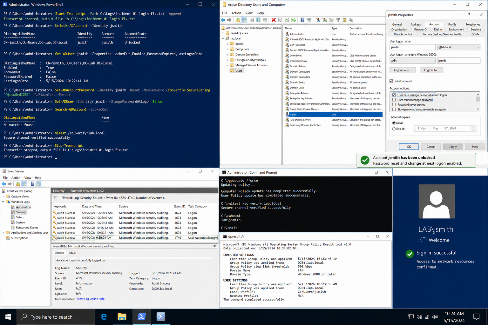

# Incident 01 Login Failure - Fix

## Objective

Restore user access by resolving the confirmed account lockout issue while maintaining proper audit logging and validation.

---

# Environment

| System | Role | IP Address |
|---|---|---|
| DC01 | Domain Controller | 192.168.100.10 |
| CLIENT01 | Windows Client | 192.168.100.20 |

Domain:

```text
lab.local
```

---

# Prerequisites

Before starting:

- Domain Admin access available
- Active Directory operational
- CLIENT01 connected to the domain
- PowerShell running as Administrator

Verify domain connectivity:

```powershell
Resolve-DnsName lab.local
```

Verify Active Directory access:

```powershell
Get-ADDomain
```

---

# Resolution Procedure

## Start PowerShell Transcript

```powershell
Start-Transcript -Path C:\Logs\incident-01-login-fix.txt -Append
```

---

## Unlock The User Account

```powershell
Unlock-ADAccount -Identity jsmith
```

Verify account status:

```powershell
Get-ADUser jsmith -Properties LockedOut
```

Expected result:

```text
LockedOut : False
```

---

## Reset Password

```powershell
Set-ADAccountPassword `
-Identity jsmith `
-Reset `
-NewPassword (ConvertTo-SecureString 'P@ssw0rd123!' -AsPlainText -Force)
```

Require password change at next sign-in:

```powershell
Set-ADUser `
-Identity jsmith `
-ChangePasswordAtLogon $true
```

---

# Refresh Client State

On CLIENT01 run:

```powershell
gpupdate /force
```

Sign out and sign back in using the updated credentials.

---

# GUI Path

For GUI validation:

```text
Server Manager
→ Tools
→ Active Directory Users and Computers
```

Locate:

```text
lab.local
→ Users
→ jsmith
```

Review:
- account status
- lockout state
- password settings

Confirm the account is unlocked.

---

# Validation

Verify no accounts remain locked:

```powershell
Search-ADAccount -LockedOut
```

Verify secure channel:

```powershell
nltest /sc_verify:lab.local
```

Verify Group Policy processing:

```powershell
gpresult /r
```

Confirm the user can:
- sign in successfully
- access domain resources
- open mapped drives
- authenticate without lockout errors

---

# Event Log Verification

Open:

```text
Event Viewer
→ Windows Logs
→ Security
```

Verify:
- no new Event ID 4740 lockouts
- successful authentication events present
- no repeated credential failures

---

# Stop PowerShell Transcript

```powershell
Stop-Transcript
```

---

# Screenshot Capture



