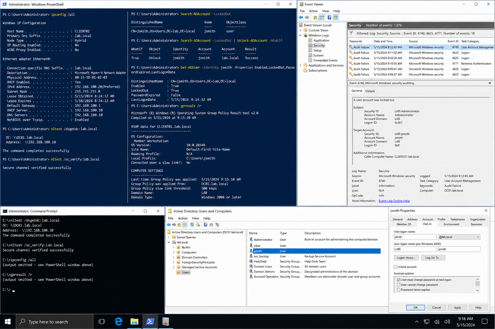

# Incident 01 Login Failure - Issue Report

## Objective

Document and investigate a user login failure incident in the `lab.local` environment.

---

# Incident Summary

| Item | Details |
|---|---|
| Incident ID | INC-0001 |
| Reported User | John Smith |
| Username | jsmith |
| Department | Sales |
| Priority | P2 |
| Reported Time | 2026-04-25 09:00 |
| Domain | lab.local |
| Domain Controller | DC01 |
| Client System | CLIENT01 |
| Error Message | The referenced account is currently locked out |

---

# Environment

| System | Role | IP Address |
|---|---|---|
| DC01 | Domain Controller | 192.168.100.10 |
| CLIENT01 | Windows Client | 192.168.100.20 |

Domain:

```text
lab.local
```

---

# Initial Triage

The following checks were completed during the initial investigation:

- confirmed user identity
- confirmed workstation name
- confirmed network connectivity
- verified DNS configuration
- reviewed account lockout status
- verified domain controller reachability
- checked Event Viewer security logs

---

# User Symptoms

The affected user reported:
- unable to sign in to Windows
- login failure after returning from vacation
- repeated credential prompt failures
- domain authentication error displayed at sign-in

Displayed error:

```text
The referenced account is currently locked out.
```

---

# Diagnostic Commands

Verify DNS configuration:

```powershell
ipconfig /all
```

Verify domain controller discovery:

```powershell
nltest /dsgetdc:lab.local
```

Check account lockout state:

```powershell
Search-ADAccount -LockedOut
```

Verify Group Policy processing:

```powershell
gpresult /r
```

Verify secure channel:

```powershell
nltest /sc_verify:lab.local
```

---

# Event Viewer Investigation

Open:

```text
Event Viewer
→ Windows Logs
→ Security
```

Review the following Event IDs:
- 4740
- 4625
- 4771

Confirm:
- source workstation
- failed authentication attempts
- account lockout activity
- authentication timestamps

---

# Evidence Collection

Collect and attach:
- PowerShell output
- Event Viewer screenshots
- account properties screenshots
- gpresult output
- DNS verification results
- login failure screenshots

Store screenshots under:

```text
screenshots/
```

---

# Validation

Confirm:
- CLIENT01 resolves lab.local correctly
- DC01 reachable from client
- account state verified successfully
- issue reproduced before remediation
- evidence attached to incident record

---

# Screenshot Capture



