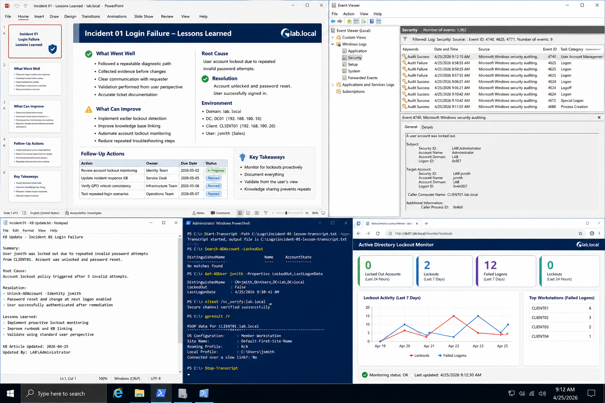

# Incident 01 Login Failure - Lessons Learned

## Objective

Document operational lessons learned after resolving the user login failure incident in the `lab.local` environment.

---

# Incident Summary

| Item | Details |
|---|---|
| Incident ID | INC-0001 |
| Affected User | jsmith |
| Department | Sales |
| Environment | lab.local |
| Domain Controller | DC01 |
| Client System | CLIENT01 |
| Root Cause | User account lockout |
| Resolution | Account unlocked and password reset |

---

# What Went Well

The incident response process was successful because:

- the issue was reproduced before remediation
- evidence was collected before changes were made
- troubleshooting followed a structured workflow
- Event Viewer logs were reviewed early
- DNS and domain connectivity were verified
- validation was performed from the user perspective
- ticket documentation remained accurate throughout the incident

The technician confirmed:
- account lockout state
- client domain connectivity
- secure channel status
- Group Policy processing
- successful sign-in after remediation

---

# Improvement Areas

The following areas should be improved:

- implement earlier lockout detection monitoring
- improve incident response documentation consistency
- reduce repeated troubleshooting steps between shifts
- improve knowledge base linking for recurring incidents
- increase proactive review of Event ID 4740 lockouts

---

# Follow-Up Actions

Create operational follow-up tasks for:

| Action | Owner | Status |
|---|---|---|
| Review account lockout monitoring | Identity Team | Pending |
| Update incident response KB | Service Desk | Pending |
| Verify GPO refresh consistency | Infrastructure Team | Pending |
| Test repeated login scenarios | Operations Team | Pending |

---

# Related Runbooks

Reference the following procedures when applicable:

- [Active Directory Procedures](../../manual-configurations/active-directory/README.md)
- [Group Policy Procedures](../../manual-configurations/group-policy/README.md)
- [File Server Procedures](../../manual-configurations/file-server/README.md)
- [DNS And DHCP Procedures](../../manual-configurations/dns-dhcp/README.md)

---

# Validation

Confirm the following after remediation:

```powershell
Search-ADAccount -LockedOut
```

```powershell
gpresult /r
```

```powershell
nltest /sc_verify:lab.local
```

Verify:
- no additional lockout events generated
- user authentication successful
- domain resources accessible
- Group Policy applied successfully

---

# Event Log Review

Open:

```text
Event Viewer
→ Windows Logs
→ Security
```

Review:
- Event ID 4740
- Event ID 4625
- Event ID 4771

Confirm:
- no repeated authentication failures
- successful login events recorded
- lockout source identified correctly

---

# Screenshot Capture



