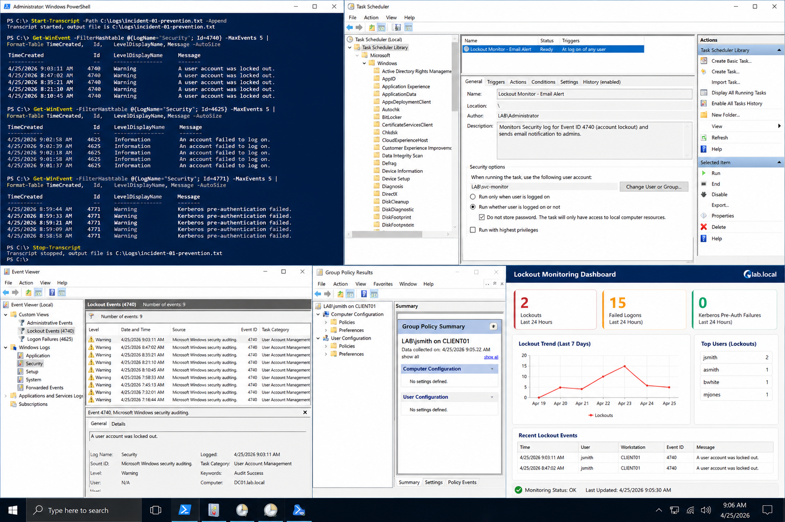

# Incident 01 Login Failure - Prevention

## Objective

Implement preventive controls that reduce repeated login failure incidents and improve early detection within the `lab.local` environment.

---

# Preventive Controls

To reduce recurrence:

- monitor account lockout activity
- detect repeated authentication failures
- improve credential auditing
- maintain operational documentation
- validate monitoring alerts regularly

This lab environment uses:

| System | Role | IP Address |
|---|---|---|
| DC01 | Domain Controller | 192.168.100.10 |
| CLIENT01 | Windows Client | 192.168.100.20 |

Domain:

```text
lab.local
```

---

# Monitoring Configuration

Monitor these Windows Security Event IDs:

| Event ID | Description |
|---|---|
| 4740 | Account locked out |
| 4625 | Failed logon |
| 4771 | Kerberos pre-authentication failure |

Recommended monitoring targets:

- Domain Controller Security log
- Group Policy Operational log
- DNS Server events
- File access auditing where required

---

# Scheduled Monitoring Example

Create a scheduled monitoring task:

```powershell
Start-Transcript -Path C:\Logs\incident-01-prevention.txt -Append
```

Check recent account lockouts:

```powershell
Get-WinEvent `
-FilterHashtable @{
    LogName='Security'
    ID=4740
} -MaxEvents 10
```

Verify failed logons:

```powershell
Get-WinEvent `
-FilterHashtable @{
    LogName='Security'
    ID=4625
} -MaxEvents 10
```

Stop logging:

```powershell
Stop-Transcript
```

---

# Documentation And Training

Service desk staff should collect:

- username
- computer name
- timestamp
- exact error message
- affected application or resource

Document recovery procedures in the internal knowledge base.

Examples:
- unlock account process
- password reset process
- cached credential cleanup
- workstation trust repair

---

# Monthly Control Review

Review the prevention controls monthly.

Verify:
- monitoring scripts still execute
- alerts reach administrators
- event logs are retained
- task ownership is current
- scheduled tasks complete successfully

Check scheduled tasks:

```powershell
Get-ScheduledTask
```

Verify event log collection:

```powershell
Get-WinEvent -LogName Security -MaxEvents 5
```

---

# Validation

Validate prevention controls by:

```powershell
Get-WinEvent `
-FilterHashtable @{
    LogName='Security'
    ID=4740
} -MaxEvents 5
```

Confirm:
- lockout events are detected
- alerts are generated
- logs are retained
- administrators receive notifications

---

# Screenshot Capture



