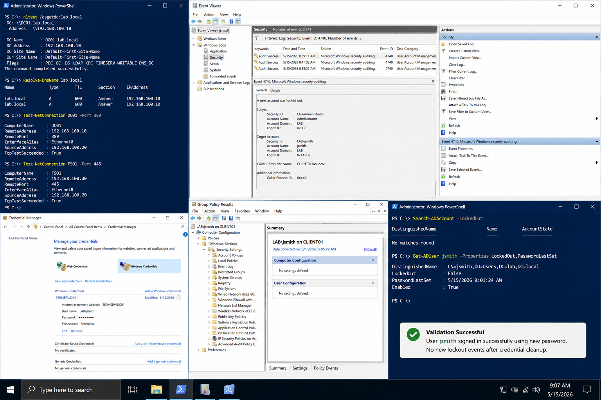

# Incident 01 Login Failure - Root Cause

## Objective

Identify and document the verified root cause of the login failure incident in the `lab.local` environment.

---

# Root Cause Statement

The root cause was:

```text
Saved old credentials on CLIENT01 continuously submitted an outdated password after password expiration.
```

This caused repeated authentication failures and triggered account lockouts for:

```text
LAB\jsmith
```

Affected systems:

| System | Role | IP Address |
|---|---|---|
| DC01 | Domain Controller | 192.168.100.10 |
| CLIENT01 | Windows Client | 192.168.100.20 |

Domain:

```text
lab.local
```

---

# Contributing Factors

The following conditions contributed to the incident:

- cached domain credentials
- repeated automatic authentication attempts
- account password expiration
- delayed user sign-in validation
- workstation credential persistence

Additional environmental factors reviewed:

- Group Policy application
- DNS resolution
- SMB access
- domain controller availability
- LDAP connectivity

---

# Evidence Collection

Review account lockout events:

```powershell
Get-WinEvent `
-FilterHashtable @{
    LogName='Security'
    ID=4740
} -MaxEvents 10
```

Verify domain controller connectivity:

```powershell
nltest /dsgetdc:lab.local
```

Verify DNS resolution:

```powershell
Resolve-DnsName lab.local
```

Verify LDAP connectivity:

```powershell
Test-NetConnection DC01 -Port 389
```

Review saved credentials on CLIENT01:

```powershell
cmdkey /list
```

---

# Proof Of Root Cause

The investigation confirmed:

- Security Event ID `4740`
- repeated failed logons from `CLIENT01`
- old credentials stored in Credential Manager
- successful authentication after credential removal

The following evidence matched the incident timeline:

| Evidence | Result |
|---|---|
| Event Viewer Security Log | Lockout source identified |
| Credential Manager | Old password stored |
| User validation test | Successful after cleanup |
| DNS validation | Working normally |
| LDAP validation | Working normally |

---

# What Was Ruled Out

The following systems were verified and excluded:

| Validation Area | Result |
|---|---|
| Domain Controller availability | Passed |
| DNS resolution | Passed |
| LDAP connectivity | Passed |
| SMB connectivity | Passed |
| Group Policy processing | Passed |

Verification commands:

```powershell
Test-NetConnection FS01 -Port 445
```

```powershell
gpresult /r
```

```powershell
nltest /sc_verify:lab.local
```

---

# Validation

After credential cleanup:

```powershell
cmdkey /delete:TERMSRV/DC01
```

User validation completed successfully:

- account no longer locked
- no new Event ID 4740 entries
- domain sign-in successful
- Group Policy refreshed correctly

---

# Screenshot Capture



