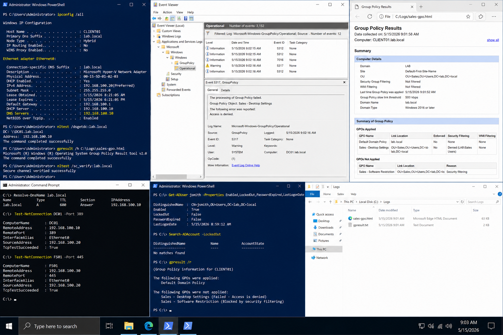

# Incident 02 GPO Not Applying - Diagnosis

## Objective

Diagnose why a Group Policy Object was not applying correctly to a workstation in the `lab.local` environment.

---

# Diagnostic Goal

The investigation focused on:

- Group Policy scope validation
- OU placement verification
- security filtering validation
- client-to-domain communication
- Group Policy processing events

Affected systems:

| System | Role | IP Address |
|---|---|---|
| DC01 | Domain Controller | 192.168.100.10 |
| CLIENT01 | Windows Client | 192.168.100.20 |

Domain:

```text
lab.local
```

---

# Step-By-Step Checks

## Verify Client Network Configuration

Run:

```powershell
ipconfig /all
```

Confirm DNS server:

```text
192.168.100.10
```

---

## Verify Domain Controller Discovery

Run:

```powershell
nltest /dsgetdc:lab.local
```

Expected result:

```text
DC: \\DC01.lab.local
```

---

## Generate Group Policy Report

Run:

```powershell
gpresult /h C:\Logs\sales-gpo.html
```

Review:
- applied GPOs
- denied GPOs
- security filtering
- OU location
- WMI filtering status

---

## Review Event Logs

Open:

```text
Event Viewer
→ Applications and Services Logs
→ Microsoft
→ Windows
→ GroupPolicy
→ Operational
```

Review Event IDs:

| Event ID | Description |
|---|---|
| 5312 | GPO applied |
| 5317 | GPO failed |
| 7016 | Policy processing issue |

---

# Useful Commands

Check secure channel:

```powershell
nltest /sc_verify:lab.local
```

Verify applied policies:

```powershell
gpresult /r
```

Verify DNS resolution:

```powershell
Resolve-DnsName lab.local
```

Check domain connectivity:

```powershell
Test-NetConnection DC01 -Port 389
```

---

# Expected Findings

The investigation should identify one of the following:

- incorrect OU placement
- blocked inheritance
- failed security filtering
- DNS resolution problem
- Group Policy replication issue
- workstation trust issue

---

# Validation

After corrective actions:

```powershell
gpupdate /force
```

Recheck policy results:

```powershell
gpresult /r
```

Confirm:
- required GPO appears in applied policies
- no Group Policy processing errors remain
- user receives expected settings

---

# Screenshot Capture


