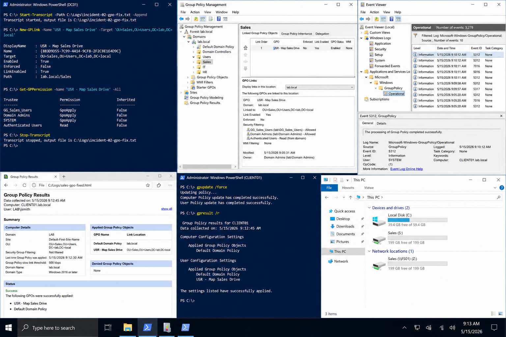

# Incident 02 GPO Not Applying - Fix

## Objective

Restore proper Group Policy application for users in the `lab.local` environment by correcting GPO link configuration and security filtering.

---

# Resolution Objective

The issue was resolved by:

- linking the GPO to the correct OU
- correcting security filtering
- refreshing Group Policy on affected clients
- validating policy application from the user perspective

Affected systems:

| System | Role | IP Address |
|---|---|---|
| DC01 | Domain Controller | 192.168.100.10 |
| CLIENT01 | Windows Client | 192.168.100.20 |

Domain:

```text
lab.local
```

---

# Fix Procedure

## Start PowerShell Logging

```powershell
Start-Transcript -Path C:\Logs\incident-02-gpo-fix.txt -Append
```

---

## Link The GPO To The Correct OU

```powershell
New-GPLink `
-Name 'USR - Map Sales Drive' `
-Target 'OU=Sales,OU=Users,DC=lab,DC=local'
```

---

## Verify Security Filtering

Check applied security filtering:

```powershell
Get-GPPermission `
-Name 'USR - Map Sales Drive' `
-All
```

Confirm the approved group exists:

```text
GG_Sales_Users
```

---

## Refresh Group Policy

Run on CLIENT01:

```powershell
gpupdate /force
```

Sign out and sign back in.

---

# GUI Path

Open:

```text
Server Manager
→ Tools
→ Group Policy Management
```

Verify:
- GPO linked to correct OU
- security filtering configured correctly
- GPO status enabled
- inheritance not blocked

Run:

```text
Group Policy Results
```

for the affected user and workstation.

---

# Validation

Verify applied Group Policies:

```powershell
gpresult /r
```

Generate HTML report:

```powershell
gpresult /h C:\Logs\sales-gpo-fixed.html
```

Confirm:
- GPO appears under Applied Group Policy Objects
- mapped drive appears successfully
- no Group Policy processing errors remain

---

# Verify Event Logs

Open:

```text
Event Viewer
→ Applications and Services Logs
→ Microsoft
→ Windows
→ GroupPolicy
→ Operational
```

Confirm:
- Event ID 5312 successful processing
- no new 5317 errors
- no policy processing failures

---

# Stop Logging

```powershell
Stop-Transcript
```

---

# Screenshot Capture


