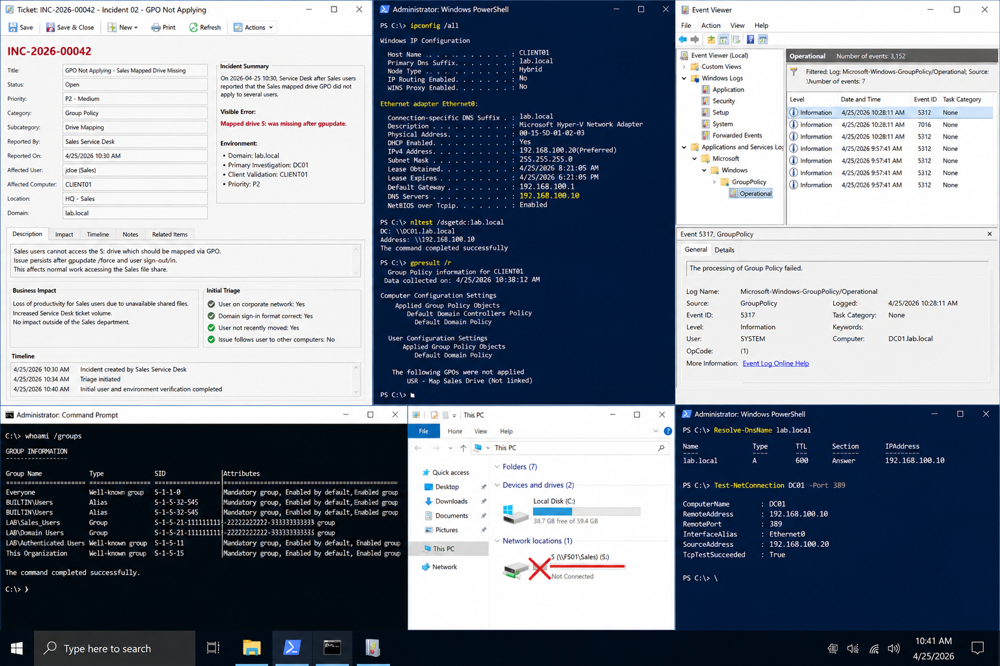

# Incident 02 GPO Not Applying - Issue Report

## Objective

Document the initial incident report and business impact for a Group Policy failure affecting mapped drives in the `lab.local` environment.

---

# Incident Summary

On:

```text
2026-04-25 10:30
```

Sales users reported that the mapped drive policy failed to apply.

Affected environment:

| System | Role | IP Address |
|---|---|---|
| DC01 | Domain Controller | 192.168.100.10 |
| CLIENT01 | Windows Client | 192.168.100.20 |

Domain:

```text
lab.local
```

Reported symptom:

```text
Mapped drive S: was missing after gpupdate.
```

Priority classification:

```text
P2
```

Reason:
- business users unable to access department share
- productivity impact limited to affected users
- no full service outage

---

# Business Impact

The incident affected:
- Sales department users
- access to shared department files
- normal workflow operations

Potential operational risks included:
- inability to access shared documents
- increased Service Desk ticket volume
- confusion during logon and policy refresh

---

# Initial Triage

The Service Desk verified:

- users connected to the corporate network
- correct domain sign-in format used
- DNS configured correctly
- users belonged to expected AD groups

The technician confirmed whether:
- the issue affected all users
- the issue followed the user to another workstation
- the mapped drive existed manually
- Group Policy processing completed successfully

---

# Evidence Collection

## Verify DNS Configuration

```powershell
ipconfig /all
```

Confirm DNS server:

```text
192.168.100.10
```

---

## Verify Domain Controller Discovery

```powershell
nltest /dsgetdc:lab.local
```

---

## Verify Applied Policies

```powershell
gpresult /r
```

Generate HTML report:

```powershell
gpresult /h C:\Logs\sales-gpo-report.html
```

---

## Verify Security Groups

```powershell
whoami /groups
```

---

## Verify Name Resolution

```powershell
Resolve-DnsName lab.local
```

---

# Operational Quality Notes

Evidence should include:
- timestamps
- screenshots
- PowerShell transcripts
- event log entries
- gpresult reports

Store screenshots under:

```text
screenshots/
```

Use consistent naming:

```text
incident-02-gpo-issue-report.png
```

---

# Troubleshooting Guidance

Work through dependencies in order:

1. DNS
2. domain connectivity
3. OU placement
4. GPO link
5. security filtering
6. share permissions
7. client-side refresh

Avoid changing multiple settings simultaneously during troubleshooting.

---

# Validation Requirement

Before closure:
- validate from a standard user account
- confirm mapped drive appears correctly
- verify GPO applies after sign-in
- confirm no Group Policy processing errors remain

---

# Screenshot Capture


