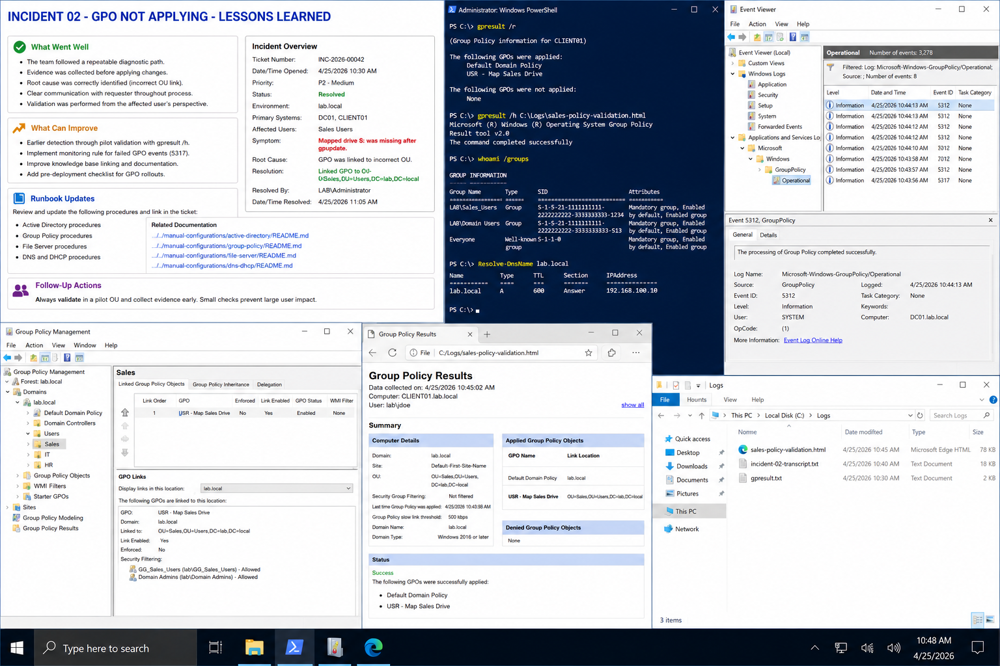

# Incident 02 GPO Not Applying - Lessons Learned

## Objective

Document operational lessons learned after resolving the Group Policy mapping failure in the `lab.local` environment.

---

# What Went Well

The incident response was effective because:

- technicians followed a structured troubleshooting process
- evidence was collected before applying changes
- validation was performed from the user perspective
- the issue was isolated quickly to GPO scope and OU linking

Successful practices included:

- using `gpresult /h`
- reviewing Group Policy Operational logs
- validating DNS before changing policy
- documenting every troubleshooting step

---

# Environment Reference

| System | Role | IP Address |
|---|---|---|
| DC01 | Domain Controller | 192.168.100.10 |
| CLIENT01 | Windows Client | 192.168.100.20 |

Domain:

```text
lab.local
```

Affected resource:

```text
\\FS01\Sales
```

Mapped drive:

```text
S:
```

---

# What Can Improve

The incident exposed several operational weaknesses:

- pilot validation was skipped
- OU placement review was incomplete
- GPO security filtering was not verified early
- documentation links were not immediately referenced

Recommended improvements:

- require `gpresult /h` validation before rollout
- implement change review checklist
- standardize GPO deployment validation
- improve runbook cross-references

---

# Runbook Updates

Review and update these procedures:

- Active Directory procedures
- Group Policy procedures
- File Server procedures
- DNS and DHCP procedures

Related documentation:

```text
../../manual-configurations/group-policy/README.md
../../manual-configurations/file-server/README.md
../../manual-configurations/dns-dhcp/README.md
```

---

# Follow-Up Actions

Create operational tasks for:

- mandatory pilot OU testing
- automated GPO validation reporting
- scheduled gpresult reviews
- periodic OU and security filtering audits

Assign:
- owner
- due date
- review cycle

---

# Recommended Validation Commands

Verify applied Group Policy:

```powershell
gpresult /r
```

Generate HTML report:

```powershell
gpresult /h C:\Logs\sales-policy-validation.html
```

Verify OU location:

```powershell
Get-ADUser jsmith -Properties DistinguishedName
```

Verify GPO links:

```powershell
Get-GPInheritance `
-Target 'OU=Sales,OU=Users,DC=lab,DC=local'
```

---

# Operational Quality Notes

Lessons learned are only valuable when they:
- improve procedures
- reduce future incidents
- shorten troubleshooting time
- improve documentation quality

Repeat the incident simulation in the lab to confirm:
- another technician can follow the documentation
- validation steps remain accurate
- prevention controls work correctly

---

# Screenshot Capture


