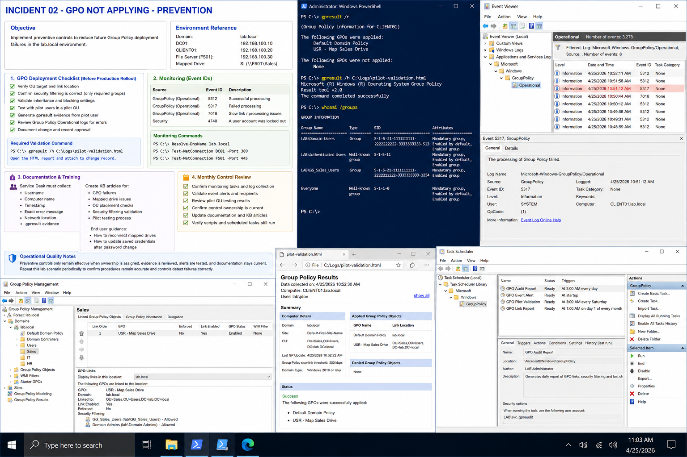

# Incident 02 GPO Not Applying - Prevention

## Objective

Implement preventive controls to reduce future Group Policy deployment failures in the `lab.local` environment.

---

# Preventive Controls

The recommended prevention strategy includes:

- mandatory GPO deployment checklist
- pilot OU validation
- security filtering verification
- gpresult evidence collection
- scheduled operational reviews

Environment reference:

| System | Role | IP Address |
|---|---|---|
| DC01 | Domain Controller | 192.168.100.10 |
| CLIENT01 | Windows Client | 192.168.100.20 |

Domain:

```text
lab.local
```

Affected resource:

```text
\\FS01\Sales
```

Mapped drive:

```text
S:
```

---

# GPO Deployment Checklist

Before production rollout:

- verify OU target
- confirm security filtering
- validate inheritance
- test with pilot users
- generate gpresult evidence
- review Group Policy Operational logs

Required validation command:

```powershell
gpresult /h C:\Logs\pilot-validation.html
```

---

# Monitoring

Monitor these event IDs:

| Event Source | Event ID | Purpose |
|---|---|---|
| GroupPolicy Operational | 5312 | Successful processing |
| GroupPolicy Operational | 5317 | Failed processing |
| GroupPolicy Operational | 7016 | Slow link or processing issues |
| Security | 4740 | Account lockout |

---

# Monitoring Commands

Verify DNS:

```powershell
Resolve-DnsName lab.local
```

Verify domain controller access:

```powershell
Test-NetConnection DC01 -Port 389
```

Verify SMB access:

```powershell
Test-NetConnection FS01 -Port 445
```

---

# Documentation And Training

Service Desk staff should collect:

- username
- computer name
- timestamp
- exact error message
- network location
- gpresult evidence

Create KB articles for:
- GPO failures
- mapped drive issues
- OU placement checks
- security filtering validation

---

# Monthly Control Review

Monthly review tasks:

- confirm monitoring still runs
- validate event collection
- review pilot OU testing
- confirm ownership
- update documentation
- review alert recipients

---

# Operational Quality Notes

Preventive controls only remain effective when:
- ownership is assigned
- evidence is reviewed
- alerts are tested
- documentation stays current

Repeat the lab scenario periodically to confirm:
- procedures remain accurate
- technicians can follow documentation
- controls detect failures correctly

---

# Screenshot Capture


