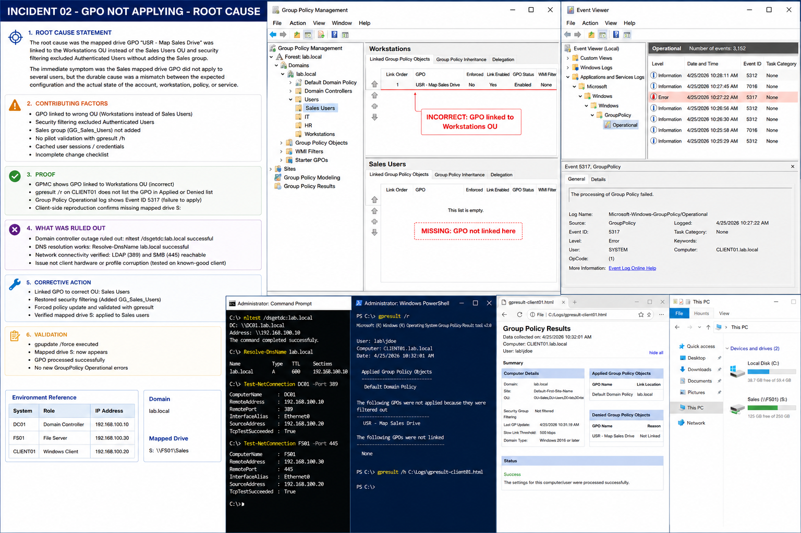

# Incident 02 GPO Not Applying - Root Cause

## Objective

Document the verified root cause behind the mapped drive Group Policy failure affecting Sales users in the `lab.local` environment.

---

# Root Cause Statement

The mapped drive GPO:

```text
USR - Map Sales Drive
```

was linked to the wrong OU:

```text
OU=Workstations
```

instead of:

```text
OU=Sales,OU=Users
```

Additionally:

- `Authenticated Users` was removed
- the `GG_Sales_Users` security group was not added
- users were outside GPO scope
- the mapped drive policy never applied

Affected drive:

```text
S:
```

Affected resource:

```text
\\FS01\Sales
```

---

# Environment Reference

| System | Role | IP Address |
|---|---|---|
| DC01 | Domain Controller | 192.168.100.10 |
| FS01 | File Server | 192.168.100.30 |
| CLIENT01 | Windows Client | 192.168.100.20 |

Domain:

```text
lab.local
```

---

# Contributing Factors

Several operational conditions increased troubleshooting complexity:

- incorrect OU targeting
- missing security filtering
- no pilot OU validation
- missing `gpresult` review
- cached user sessions
- incomplete deployment checklist

The issue appeared as:
- missing mapped drive
- incomplete GPO processing
- inconsistent user experience

---

# Proof

The root cause was confirmed using:

## Group Policy Results

```powershell
gpresult /r
```

Output showed:

```text
USR - Map Sales Drive
Denied GPOs:
Reason: Not Linked
```

---

## Group Policy Management

Verification showed:
- GPO linked to `Workstations OU`
- no link under `Sales Users OU`

---

## Event Viewer Evidence

Relevant log:

```text
Applications and Services Logs
→ Microsoft
→ Windows
→ GroupPolicy
→ Operational
```

Relevant Event IDs:

| Event ID | Meaning |
|---|---|
| 5312 | Successful processing |
| 5317 | Policy processing failure |
| 7016 | Slow link processing issue |

---

# What Was Ruled Out

The following checks confirmed core infrastructure was healthy.

Verify domain controller:

```powershell
nltest /dsgetdc:lab.local
```

Verify DNS:

```powershell
Resolve-DnsName lab.local
```

Verify LDAP connectivity:

```powershell
Test-NetConnection DC01 -Port 389
```

Verify SMB access:

```powershell
Test-NetConnection FS01 -Port 445
```

These tests confirmed:
- DNS functioning correctly
- domain controller reachable
- SMB services operational
- no broad infrastructure outage

---

# Corrective Action

The permanent fix included:

- linking the GPO to the correct OU
- restoring valid security filtering
- validating with pilot users
- generating updated `gpresult` evidence

Correct link target:

```powershell
New-GPLink `
-Name 'USR - Map Sales Drive' `
-Target 'OU=Sales,OU=Users,DC=lab,DC=local'
```

---

# Validation

After remediation:

```powershell
gpupdate /force
```

Validation confirmed:
- mapped drive `S:` appeared
- policy processed successfully
- Sales users received the drive mapping
- no new GroupPolicy operational errors appeared

---

# Operational Quality Notes

Root cause analysis must:
- identify the exact configuration failure
- include reproducible proof
- document excluded causes
- preserve troubleshooting evidence

Operational improvements should include:
- mandatory pilot validation
- GPO deployment checklists
- periodic OU review
- security filtering verification

---

# Screenshot Capture


