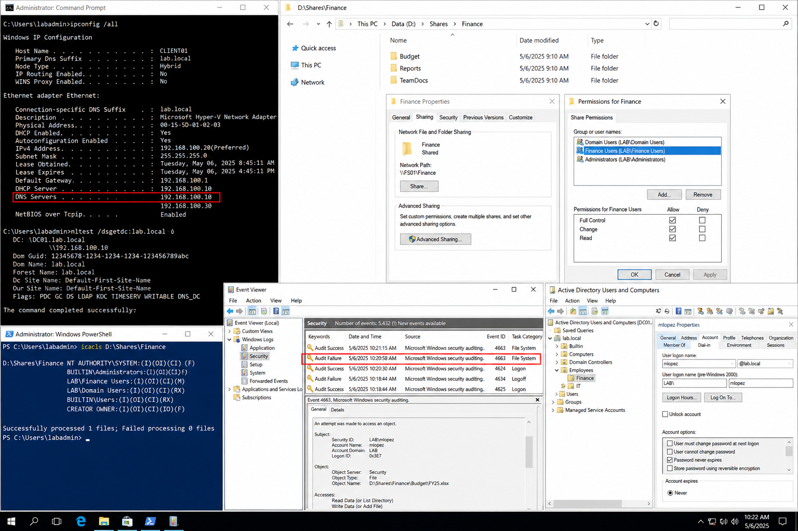

# Incident 03 File Share Access Denied - Diagnosis

## Objective

---

This procedure documents the diagnostic workflow used to identify the root cause of a file share access denial issue within the `lab.local` Windows Server 2022 environment.

The investigation focuses on validating:

- DNS resolution
- Domain controller communication
- NTFS permissions
- Share permissions
- Group membership
- Security event logs

The goal is to identify the failing layer before remediation changes are applied.

---

# Why It Matters

---

File share access problems can originate from multiple infrastructure components. Changing permissions before identifying the actual cause can create security exposure and operational inconsistency.

A structured diagnostic process ensures:

- Accurate root cause identification
- Proper evidence collection
- Reduced troubleshooting time
- Safer remediation actions
- Cleaner incident documentation

---

# Prerequisites

---

Before beginning diagnostics, confirm:

- Administrative access is available
- `CLIENT01` can communicate with `DC01`
- Event Viewer access is available
- PowerShell is launched as Administrator

Environment references:

| Component | Value |
|---|---|
| Domain | `lab.local` |
| DC01 | `192.168.100.10` |
| FS01 | `192.168.100.30` |
| CLIENT01 | `192.168.100.20` |

---

# GUI Procedure

---

1. Review the incident ticket and confirm:
   - Username
   - Source workstation
   - Failure time
   - Shared folder path

2. On `CLIENT01`, open Command Prompt and verify DNS configuration:

```powershell
ipconfig /all
```

3. Confirm the client can locate a domain controller:

```powershell
nltest /dsgetdc:lab.local
```

4. On `FS01`, review the affected folder permissions:
   - Share permissions
   - NTFS permissions
   - Group assignments

5. On `DC01`, open Event Viewer and review Security logs for:
   - Event ID `4663`
   - Failed authentication events
   - Account lockout activity

6. Compare event timestamps with the reported incident time.

7. Document all findings before changing permissions or policies.

---

# PowerShell Procedure

---

## Validate DNS Configuration

```powershell
ipconfig /all
```

---

## Validate Domain Controller Discovery

```powershell
nltest /dsgetdc:lab.local
```

---

## Validate Secure Channel

```powershell
nltest /sc_verify:lab.local
```

---

## Review NTFS Permissions

```powershell
icacls D:\Shares\Finance
```

---

## Validate User Account Status

```powershell
Get-ADUser -Identity mlopez -Properties Enabled,LockedOut,PasswordExpired,LastLogonDate
```

---

## Review Applied Group Policies

```powershell
gpresult /r
```

---

# Verification

---

The investigation should identify a confirmed cause such as:

- Incorrect NTFS permission
- Incorrect share permission
- Missing security group membership
- DNS configuration issue
- Account lockout
- Authentication failure

Validation checklist:

| Validation Item | Expected Result |
|---|---|
| DNS Resolution | Successful |
| Domain Controller Discovery | Successful |
| Secure Channel | Verified |
| Account Status | Enabled |
| NTFS Permissions | Correct |
| Event Logs | Matching timestamps found |

After remediation, validate file access from `CLIENT01` using a standard domain user account.

---

# Common Issues And Fixes

---

| Issue | Cause | Resolution |
|---|---|---|
| Access denied | NTFS restriction | Correct folder permissions |
| `nltest` failure | DNS issue | Configure DNS to `192.168.100.10` |
| No security logs | Auditing disabled | Enable object access auditing |
| User authentication failure | Locked account | Unlock account and retest |

---

# Operational Quality Notes

---

This procedure is intended for the `lab.local` enterprise lab environment using Windows Server 2022 systems.

During troubleshooting:

- Record exact commands
- Record exact timestamps
- Capture evidence before remediation
- Test using a standard user account after changes

Avoid making permission changes before identifying the actual failing component.

Reference:

```text
../../ticketing-system/README.md
```

---

# Screenshot Capture

---

| Screenshot Requirement | Suggested Filename |
|---|---|
| Security log and permission validation | `incident-03-file-share-access-denied-diagnosis.png` |

---

## Screenshot Reference

---



