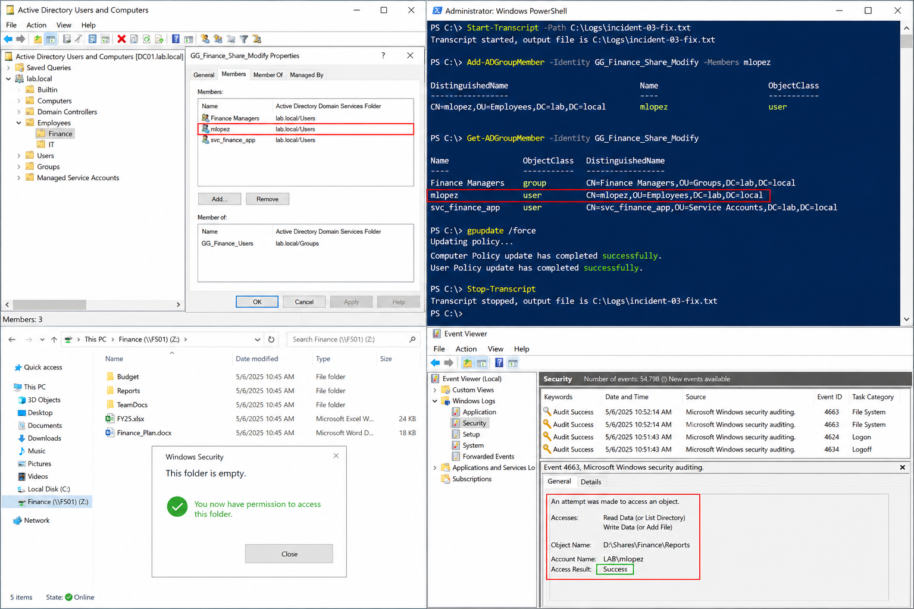

# Incident 03 File Share Access Denied - Fix

## Objective

---

This procedure documents the remediation steps used to restore file share access within the `lab.local` Windows Server 2022 environment after the root cause was confirmed during diagnostics.

The approved fix adds the affected user to the correct Finance share security group while preserving auditability and minimizing operational impact.

---

# Why It Matters

---

Access issues should be resolved using the smallest possible change required to restore service.

Avoiding unnecessary changes helps prevent:

- Excessive permission exposure
- Unauthorized file access
- Domain-wide impact
- Inheritance conflicts
- Audit inconsistencies

This procedure follows enterprise operational standards by validating the root cause before remediation.

---

# Prerequisites

---

Before starting remediation, confirm:

- Root cause has been identified
- Administrative credentials are available
- PowerShell is launched as Administrator
- Incident evidence has been collected
- Change approval or ticket authorization exists

Environment references:

| Component | Value |
|---|---|
| Domain | `lab.local` |
| DC01 | `192.168.100.10` |
| FS01 | `192.168.100.30` |
| CLIENT01 | `192.168.100.20` |

---

# GUI Procedure

---

1. Notify the requester that remediation is beginning.

2. On `DC01`, open:
   - Active Directory Users and Computers

3. Locate the affected security group:

```text
GG_Finance_Share_Modify
```

4. Add the affected user account:

```text
mlopez
```

5. Confirm the membership update applies successfully.

6. On `CLIENT01`, refresh policy and authentication state:
   - Sign out
   - Sign back in
   - Run policy refresh if required

7. Ask the requester to repeat the original action.

8. Confirm file access now succeeds without administrative elevation.

9. Review Security logs on `DC01` and confirm failure events no longer appear.

10. Update the incident ticket with:
   - Exact change performed
   - Validation results
   - Resolution timestamp

---

# PowerShell Procedure

---

## Start PowerShell Transcript

```powershell
Start-Transcript -Path C:\Logs\incident-03-fix.txt
```

---

## Add User To Finance Modify Group

```powershell
Add-ADGroupMember -Identity GG_Finance_Share_Modify -Members mlopez
```

---

## Refresh Group Policy

```powershell
gpupdate /force
```

---

## Validate Updated Group Membership

```powershell
Get-ADGroupMember -Identity GG_Finance_Share_Modify
```

---

## Stop PowerShell Transcript

```powershell
Stop-Transcript
```

---

# Verification

---

Successful remediation should confirm:

- User can access the Finance share
- No access denied message appears
- Group membership is updated correctly
- Security logs no longer show failures
- Access works from a standard user session

Validation checklist:

| Validation Item | Expected Result |
|---|---|
| Group Membership | Updated successfully |
| gpupdate | Completed successfully |
| File Share Access | Successful |
| Security Logs | No repeated failures |
| Standard User Validation | Successful |

---

# Common Issues And Fixes

---

| Issue | Cause | Resolution |
|---|---|---|
| Access still denied | User token not refreshed | Sign out and sign back in |
| Group membership not visible | Replication delay | Wait for AD replication |
| `Add-ADGroupMember` failure | Insufficient privileges | Use elevated administrative account |
| gpupdate failure | Network or DNS issue | Validate connectivity to `DC01` |

---

# Operational Quality Notes

---

This procedure is intended for the `lab.local` Windows Server 2022 enterprise lab environment.

Operational best practices:

- Apply the smallest required change
- Preserve audit evidence
- Avoid broad permission changes
- Validate using standard user accounts
- Record exact commands and timestamps

Capture evidence at three stages:

| Stage | Example Evidence |
|---|---|
| Initial State | Access denied screenshot |
| Configuration Change | Group membership update |
| Final Verification | Successful file access |

Recommended evidence sources:

- PowerShell transcripts
- Event Viewer
- Active Directory Users and Computers
- File Explorer validation
- gpresult reports

Reference:

```text
../../ticketing-system/README.md
```

Do not close the incident until:

- Standard-user validation succeeds
- Replication completes
- Final evidence is captured
- Rollback verification is confirmed

---

# Screenshot Capture

---

| Screenshot Requirement | Suggested Filename |
|---|---|
| Group membership update and successful validation | `incident-03-file-share-access-denied-fix-verification.png` |

---

## Screenshot Reference

---



