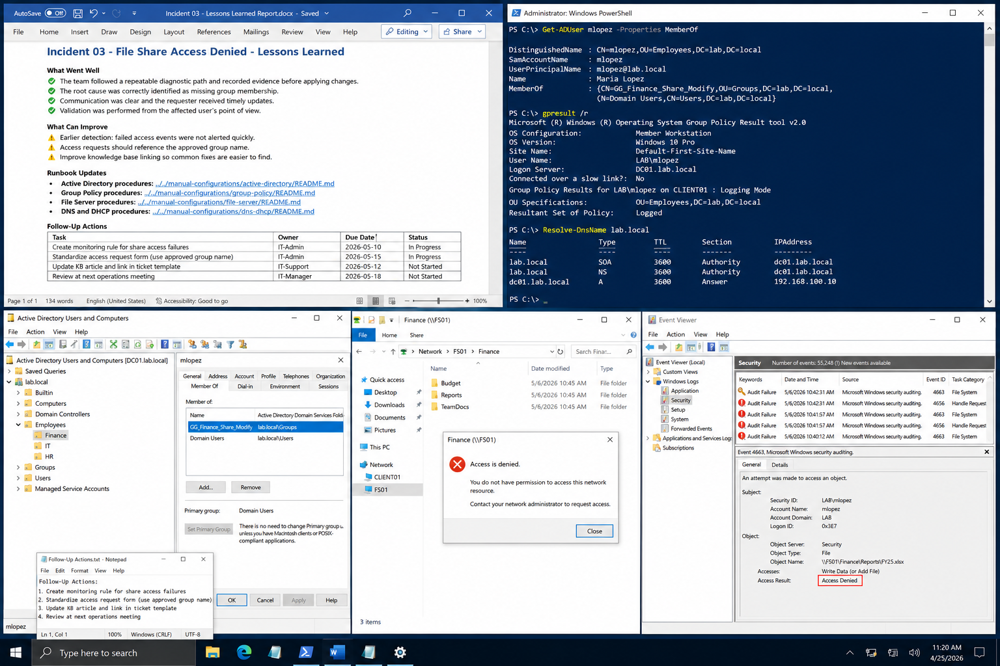

# Incident 03 File Share Access Denied - Lessons Learned

## Objective

---

This document records the operational lessons learned after resolving the Finance file share access issue within the `lab.local` Windows Server 2022 environment.

The purpose of this review is to improve future incident response efficiency, documentation quality, access management practices, and operational consistency.

---

# Why It Matters

---

A completed incident should improve future operational behavior, not only restore service.

Lessons learned reviews help:

- Reduce repeat incidents
- Improve troubleshooting consistency
- Strengthen documentation quality
- Improve escalation efficiency
- Enhance monitoring and detection
- Standardize remediation procedures

Operational maturity depends on documenting both successful actions and areas requiring improvement.

---

# Prerequisites

---

Before completing the lessons learned review, confirm:

- The incident is fully resolved
- Validation testing succeeded
- Evidence has been collected
- Ticket documentation is complete
- Final remediation steps are documented

Environment references:

| Component | Value |
|---|---|
| Domain | `lab.local` |
| DC01 | `192.168.100.10` |
| FS01 | `192.168.100.30` |
| CLIENT01 | `192.168.100.20` |

---

# GUI Procedure

---

1. Review the completed incident ticket.

2. Confirm:
   - Root cause
   - Resolution steps
   - Validation results
   - Evidence collection

3. Verify that screenshots and transcripts are stored in the correct evidence location.

4. Review related operational documentation and update affected runbooks if necessary.

5. Confirm the incident references:
   - Active Directory procedures
   - Group Policy procedures
   - File Server procedures
   - DNS and DHCP procedures

6. Create follow-up tasks for:
   - Monitoring improvements
   - Documentation updates
   - Process improvements
   - Knowledge base updates

7. Review the incident during the next operations meeting.

---

# PowerShell Procedure

---

## Review User Group Membership

```powershell
Get-ADUser mlopez -Properties MemberOf
```

---

## Review Applied Group Policies

```powershell
gpresult /r
```

---

## Validate DNS Resolution

```powershell
Resolve-DnsName lab.local
```

---

## Review Security Events

```powershell
Get-EventLog -LogName Security -Newest 20
```

---

# Verification

---

The lessons learned review should confirm:

- Root cause was properly identified
- Remediation followed operational standards
- Evidence collection was completed
- Documentation was updated
- Follow-up actions were assigned

Validation checklist:

| Validation Item | Expected Result |
|---|---|
| Incident Resolution | Completed |
| Evidence Collection | Completed |
| Documentation Update | Completed |
| Follow-Up Actions | Assigned |
| Standard User Validation | Successful |

---

# Common Issues And Fixes

---

| Issue | Cause | Resolution |
|---|---|---|
| Repeat access incidents | Missing documentation | Update operational runbooks |
| Delayed response | Limited monitoring | Improve alerting and reporting |
| Incorrect permission requests | Group naming confusion | Standardize access request process |
| Incomplete evidence | Missing capture process | Require evidence checklist |

---

# Operational Quality Notes

---

This procedure is intended for the `lab.local` Windows Server 2022 enterprise lab environment.

Operational best practices include:

- Recording evidence before remediation
- Using least-privilege changes
- Testing from standard user accounts
- Maintaining repeatable troubleshooting steps
- Updating runbooks after incidents

Reference the following operational documentation where applicable:

```text
../../manual-configurations/active-directory/README.md
../../manual-configurations/group-policy/README.md
../../manual-configurations/file-server/README.md
../../manual-configurations/dns-dhcp/README.md
../../ticketing-system/README.md
```

Capture evidence at the following stages:

| Stage | Example Evidence |
|---|---|
| Initial State | Access denied screenshot |
| Configuration Change | Group membership update |
| Final Verification | Successful user validation |

Do not close the incident until:

- Standard-user testing succeeds
- Evidence is archived
- Documentation updates are completed
- Follow-up actions are assigned

---

# Screenshot Capture

---

| Screenshot Requirement | Suggested Filename |
|---|---|
| Incident review and successful operational validation | `incident-03-file-share-access-denied-lessons-learned-verification.png` |

---

## Screenshot Reference

---


