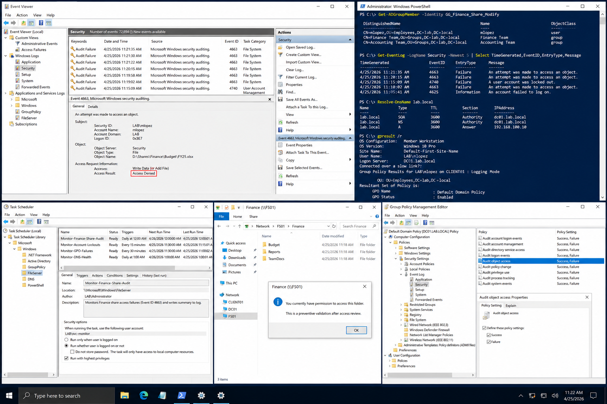

# Incident 03 File Share Access Denied - Prevention

## Objective

---

This document defines preventive controls and operational practices designed to reduce recurrence of Finance file share access issues within the `lab.local` Windows Server 2022 environment.

The prevention strategy focuses on:

- Access control validation
- Monitoring and alerting
- Documentation improvement
- Operational consistency
- Administrative auditing

---

# Why It Matters

---

Preventive controls reduce operational risk by identifying access issues before they affect business operations.

Effective prevention improves:

- Incident response time
- Access auditing
- Security visibility
- Documentation consistency
- Troubleshooting accuracy

Preventive measures are only effective when they are documented, assigned, monitored, and reviewed regularly.

---

# Prerequisites

---

Before implementing preventive controls, confirm:

- File access auditing is configured
- Monitoring systems are operational
- Security event logging is enabled
- Administrative ownership is assigned
- Documentation repositories are updated

Environment references:

| Component | Value |
|---|---|
| Domain | `lab.local` |
| DC01 | `192.168.100.10` |
| FS01 | `192.168.100.30` |
| CLIENT01 | `192.168.100.20` |

---

# GUI Procedure

---

1. Review existing Finance share permissions on `FS01`.

2. Confirm security groups are used instead of direct user assignments.

3. Verify onboarding documentation clearly distinguishes:
   - Distribution groups
   - Security groups

4. On `DC01`, review Event Viewer monitoring configuration for:
   - Security event `4663`
   - Security event `4740`
   - Group Policy operational logs

5. Confirm monitoring alerts are sent to the correct operational team.

6. Review scheduled tasks or monitoring scripts used for:
   - Access auditing
   - Lockout monitoring
   - DNS health monitoring
   - Group Policy failure detection

7. Update operational documentation and knowledge base articles.

---

# PowerShell Procedure

---

## Review Security Group Membership

```powershell
Get-ADGroupMember -Identity GG_Finance_Share_Modify
```

---

## Review Failed Security Events

```powershell
Get-EventLog -LogName Security -Newest 20
```

---

## Validate DNS Resolution

```powershell
Resolve-DnsName lab.local
```

---

## Review Applied Group Policies

```powershell
gpresult /r
```

---

## Review Locked Accounts

```powershell
Search-ADAccount -LockedOut
```

---

# Verification

---

Preventive controls should confirm:

- Monitoring is operational
- Event logs are collected successfully
- Access auditing functions correctly
- Knowledge base documentation is updated
- Ownership and review schedules are assigned

Validation checklist:

| Validation Item | Expected Result |
|---|---|
| Event Logging | Enabled |
| Access Auditing | Operational |
| Monitoring Alerts | Successful |
| Documentation Updates | Completed |
| Preventive Review Schedule | Assigned |

---

# Common Issues And Fixes

---

| Issue | Cause | Resolution |
|---|---|---|
| Missing audit logs | Auditing disabled | Enable object access auditing |
| Incorrect access requests | Group confusion | Standardize onboarding process |
| Delayed incident detection | No monitoring | Implement alerting rules |
| Outdated documentation | Missing review process | Schedule monthly review |

---

# Operational Quality Notes

---

This procedure is intended for the `lab.local` Windows Server 2022 enterprise lab environment.

Operational best practices include:

- Using security groups for access control
- Reviewing monitoring regularly
- Maintaining operational documentation
- Validating alerts and logging
- Performing periodic access reviews

Recommended preventive monitoring includes:

| Monitoring Area | Recommended Event |
|---|---|
| File Access | Security `4663` |
| Account Lockout | Security `4740` |
| Group Policy Failures | GroupPolicy Operational Log |
| DNS Health | Failed lookup trends |

Reference documentation:

```text
../../manual-configurations/active-directory/README.md
../../manual-configurations/group-policy/README.md
../../manual-configurations/file-server/README.md
../../manual-configurations/dns-dhcp/README.md
../../ticketing-system/README.md
```

Review preventive controls monthly to confirm:

- Scripts still run successfully
- Alerts reach the correct team
- Logs are retained properly
- Documentation reflects the current environment

Do not rely on undocumented scripts or unverified monitoring rules in production environments.

---

# Screenshot Capture

---

| Screenshot Requirement | Suggested Filename |
|---|---|
| Monitoring and preventive control validation | `incident-03-file-share-access-denied-prevention-verification.png` |

---

## Screenshot Reference

---



