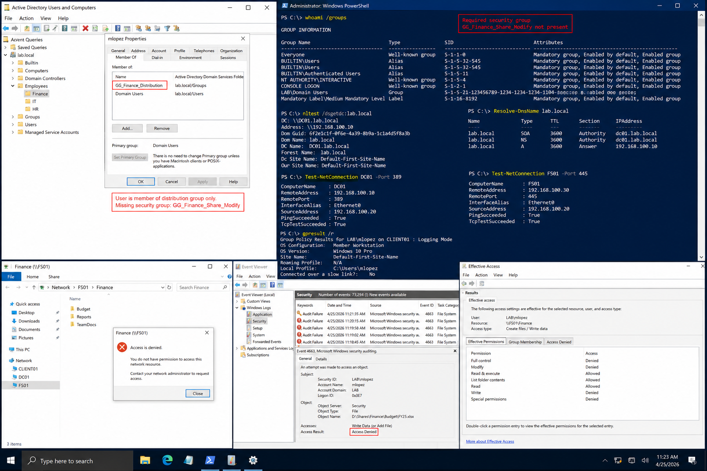

# Incident 03 File Share Access Denied - Root Cause

## Objective

---

This document records the confirmed root cause analysis for the Finance file share access issue within the `lab.local` Windows Server 2022 environment.

The purpose of this review is to identify the exact failure condition, document supporting evidence, and distinguish the true root cause from contributing environmental conditions.

---

# Why It Matters

---

Root cause analysis prevents recurring incidents by identifying the actual configuration failure instead of only correcting the visible symptom.

A complete root cause review helps:

- Improve troubleshooting accuracy
- Reduce repeat incidents
- Improve operational documentation
- Strengthen access management processes
- Support audit and compliance requirements

The incident is not considered resolved until the technical team can explain:

- Why the issue occurred
- Why it affected the specific user
- Why it appeared at that time

---

# Prerequisites

---

Before completing root cause analysis, confirm:

- Diagnostic evidence has been collected
- Validation testing is complete
- Event logs are available
- User reproduction testing succeeded
- Remediation actions are documented

Environment references:

| Component | Value |
|---|---|
| Domain | `lab.local` |
| DC01 | `192.168.100.10` |
| FS01 | `192.168.100.30` |
| CLIENT01 | `192.168.100.20` |

---

# GUI Procedure

---

1. Review the incident ticket and collected evidence.

2. Confirm the affected user:
   - Could browse the Finance share
   - Could not create or modify files

3. On `DC01`, review:
   - Active Directory group membership
   - Security group assignments
   - User account status

4. On `FS01`, review:
   - Share permissions
   - NTFS permissions
   - Effective Access results

5. Confirm the user was added to:
   - Distribution group only
   - Not the required security group:
   
```text
GG_Finance_Share_Modify
```

6. Validate that the issue reproduces consistently before remediation.

7. Confirm the issue no longer reproduces after:
   - Group membership correction
   - User sign-out/sign-in
   - Group Policy refresh

---

# PowerShell Procedure

---

## Validate User Group Membership

```powershell
whoami /groups
```

---

## Validate Domain Controller Discovery

```powershell
nltest /dsgetdc:lab.local
```

---

## Validate DNS Resolution

```powershell
Resolve-DnsName lab.local
```

---

## Validate LDAP Connectivity

```powershell
Test-NetConnection DC01 -Port 389
```

---

## Validate SMB Connectivity

```powershell
Test-NetConnection FS01 -Port 445
```

---

## Review Applied Group Policies

```powershell
gpresult /r
```

---

# Verification

---

The confirmed root cause should validate the following findings:

| Validation Item | Result |
|---|---|
| Distribution Group Membership | Present |
| Security Group Membership | Missing |
| Effective Access | Read-only |
| Share Browsing | Successful |
| File Creation | Failed |
| DNS Resolution | Successful |
| Domain Controller Discovery | Successful |

The issue is considered resolved only after:

- Group membership is corrected
- User authentication token is refreshed
- File creation succeeds
- Access denial events stop recurring

---

# Common Issues And Fixes

---

| Issue | Cause | Resolution |
|---|---|---|
| Read-only access only | Missing NTFS modify permission | Add user to security group |
| User appears correctly assigned | Distribution group used instead of security group | Correct group assignment |
| Intermittent access issues | Cached credentials | Force sign-out and sign-in |
| Access issue persists after fix | Policy token not refreshed | Run `gpupdate /force` |

---

# Operational Quality Notes

---

This procedure is intended for the `lab.local` Windows Server 2022 enterprise lab environment.

Operational best practices include:

- Capturing evidence before remediation
- Verifying group membership carefully
- Separating contributing factors from root cause
- Testing from standard user accounts
- Recording timestamps and exact commands

The following conditions were ruled out during investigation:

| Validation Area | Verification Method |
|---|---|
| Domain Controller Availability | `nltest /dsgetdc:lab.local` |
| DNS Resolution | `Resolve-DnsName lab.local` |
| LDAP Connectivity | `Test-NetConnection DC01 -Port 389` |
| SMB Connectivity | `Test-NetConnection FS01 -Port 445` |
| Client Workstation Issue | Known-good client validation |

Reference documentation:

```text
../../ticketing-system/README.md
```

Do not close the incident until:

- Root cause is fully documented
- Evidence is archived
- Standard-user validation succeeds
- Recurrence testing is complete

---

# Screenshot Capture

---

| Screenshot Requirement | Suggested Filename |
|---|---|
| Root cause validation and access review | `incident-03-file-share-access-denied-root-cause-verification.png` |

---

## Screenshot Reference

---



