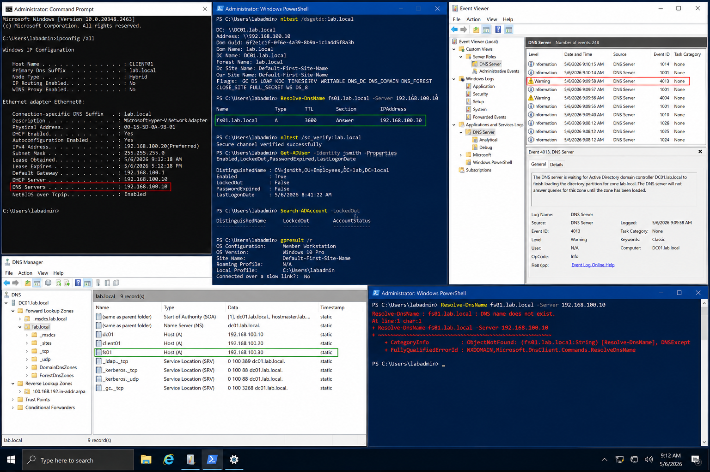

# Incident 04 DNS Resolution Failure - Diagnosis

## Objective

---

This procedure documents the diagnostic workflow used to investigate DNS resolution failures within the `lab.local` Windows Server 2022 environment.

The investigation focuses on validating:

- DNS server configuration
- Client resolver functionality
- DNS record existence
- Cache state
- Domain controller communication
- DNS-related event logging

The goal is to identify the failing layer before remediation changes are applied.

---

# Why It Matters

---

DNS failures can interrupt authentication, file access, Group Policy processing, and application connectivity across the environment.

A structured diagnostic process helps:

- Prevent unnecessary configuration changes
- Preserve troubleshooting evidence
- Reduce service downtime
- Improve root cause identification
- Support operational auditing

Accurate DNS troubleshooting requires validation of both client and server-side components.

---

# Prerequisites

---

Before beginning diagnostics, confirm:

- Administrative access is available
- PowerShell is launched as Administrator
- Event Viewer access is available on `DC01`
- DNS services are operational
- The incident ticket contains:
  - Username
  - Source workstation
  - Failure timestamp
  - Reported error message

Environment references:

| Component | Value |
|---|---|
| Domain | `lab.local` |
| DC01 | `192.168.100.10` |
| FS01 | `192.168.100.30` |
| CLIENT01 | `192.168.100.20` |

---

# GUI Procedure

---

1. Review the incident ticket and confirm:
   - Username
   - Computer name
   - Failure time
   - DNS-related symptoms

2. On `CLIENT01`, open Command Prompt and verify DNS configuration:

```powershell
ipconfig /all
```

3. Confirm the configured DNS server is:

```text
192.168.100.10
```

4. Validate domain controller discovery:

```powershell
nltest /dsgetdc:lab.local
```

5. Test DNS resolution against the domain controller:

```powershell
Resolve-DnsName fs01.lab.local -Server 192.168.100.10
```

6. On `DC01`, open Event Viewer and review:
   - DNS Server logs
   - Security logs
   - DNS-related warning or failure events

7. Review relevant event IDs:

| Event ID | Description |
|---|---|
| 4013 | DNS server waiting for Active Directory |
| 4004 | DNS server startup issue |
| Client DNS cache events | Resolver-related failures |

8. Compare timestamps with the reported incident.

9. Document all findings before making DNS or policy changes.

---

# PowerShell Procedure

---

## Validate DNS Configuration

```powershell
ipconfig /all
```

---

## Validate Domain Controller Discovery

```powershell
nltest /dsgetdc:lab.local
```

---

## Validate Secure Channel

```powershell
nltest /sc_verify:lab.local
```

---

## Test DNS Resolution

```powershell
Resolve-DnsName fs01.lab.local -Server 192.168.100.10
```

---

## Validate User Account Status

```powershell
Get-ADUser -Identity jsmith -Properties Enabled,LockedOut,PasswordExpired,LastLogonDate
```

---

## Review Locked Accounts

```powershell
Search-ADAccount -LockedOut
```

---

## Review Applied Group Policies

```powershell
gpresult /r
```

---

# Verification

---

The investigation should identify a confirmed cause such as:

- Missing DNS record
- Incorrect DNS server configuration
- DNS cache issue
- Secure channel failure
- Group Policy processing issue
- Domain controller communication issue

Validation checklist:

| Validation Item | Expected Result |
|---|---|
| DNS Resolution | Successful |
| Domain Controller Discovery | Successful |
| Secure Channel | Verified |
| DNS Record Presence | Confirmed |
| Event Logs | Matching timestamps identified |

After remediation:

- Re-test DNS resolution from `CLIENT01`
- Validate access using a standard domain user account
- Confirm the issue no longer reproduces

---

# Common Issues And Fixes

---

| Issue | Cause | Resolution |
|---|---|---|
| DNS lookup failure | Missing DNS record | Create or correct DNS record |
| Incorrect DNS server | Client misconfiguration | Configure DNS to `192.168.100.10` |
| Delayed name resolution | Stale DNS cache | Flush DNS cache |
| `nltest` failure | Domain communication issue | Validate DNS and network connectivity |

---

# Operational Quality Notes

---

This procedure is intended for the `lab.local` Windows Server 2022 enterprise lab environment.

Operational best practices:

- Record exact commands and timestamps
- Preserve evidence before remediation
- Validate from standard user workstations
- Confirm DNS replication where applicable
- Avoid temporary workarounds before identifying root cause

Capture evidence at three stages:

| Stage | Example Evidence |
|---|---|
| Initial State | DNS failure screenshot |
| Configuration Change | DNS console or PowerShell evidence |
| Final Verification | Successful resolution output |

Recommended evidence sources:

- Event Viewer
- PowerShell transcripts
- DNS Manager
- gpresult reports
- Command Prompt output

Reference:

```text
../../ticketing-system/README.md
```

Do not close the incident until:

- Standard-user validation succeeds
- DNS replication completes
- Evidence is archived
- Rollback verification is complete

---

# Screenshot Capture

---

| Screenshot Requirement | Suggested Filename |
|---|---|
| DNS resolution investigation and validation | `incident-04-dns-resolution-failure-diagnosis-verification.png` |

---

## Screenshot Reference

---



