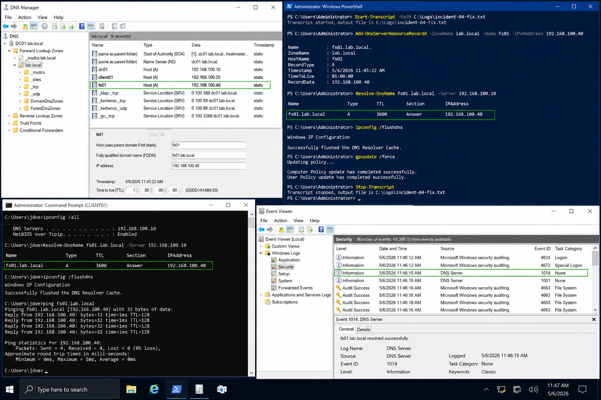

# Incident 04 DNS Resolution Failure - Fix

## Objective

---

This procedure documents the remediation workflow used to restore DNS resolution functionality within the `lab.local` Windows Server 2022 environment.

The approved fix restores service by creating the missing DNS A record and refreshing the affected client DNS cache while preserving auditability and minimizing operational impact.

---

# Why It Matters

---

DNS failures can disrupt:

- File server access
- Active Directory communication
- Group Policy processing
- Application connectivity
- Authentication workflows

Applying the smallest required change reduces operational risk and prevents unnecessary modifications to production services.

---

# Prerequisites

---

Before starting remediation, confirm:

- Root cause has been identified
- Administrative credentials are available
- DNS Manager access is operational
- PowerShell is launched as Administrator
- Evidence collection has been completed

Environment references:

| Component | Value |
|---|---|
| Domain | `lab.local` |
| DC01 | `192.168.100.10` |
| FS01 | `192.168.100.30` |
| CLIENT01 | `192.168.100.20` |

---

# GUI Procedure

---

1. Notify the requester that remediation is beginning.

2. On `DC01`, open:
   - DNS Manager

3. Navigate to:

```text
Forward Lookup Zones → lab.local
```

4. Create the missing A record for:

```text
fs01
```

5. Assign the correct IP address:

```text
192.168.100.40
```

6. Save the DNS record.

7. On `CLIENT01`, refresh client state:
   - Flush DNS cache
   - Run policy refresh if required
   - Sign out and sign back in if necessary

8. Ask the requester to repeat the original action.

9. Confirm DNS resolution succeeds and the issue no longer reproduces.

10. Update the incident ticket with:
   - Exact change performed
   - Validation results
   - Resolution timestamp

---

# PowerShell Procedure

---

## Start PowerShell Transcript

```powershell
Start-Transcript -Path C:\Logs\incident-04-fix.txt
```

---

## Create DNS A Record

```powershell
Add-DnsServerResourceRecordA -ZoneName lab.local -Name fs01 -IPv4Address 192.168.100.40
```

---

## Flush Client DNS Cache

```powershell
ipconfig /flushdns
```

---

## Refresh Group Policy

```powershell
gpupdate /force
```

---

## Validate DNS Resolution

```powershell
Resolve-DnsName fs01.lab.local -Server 192.168.100.10
```

---

## Stop PowerShell Transcript

```powershell
Stop-Transcript
```

---

# Verification

---

Successful remediation should confirm:

- DNS record exists
- Client DNS cache is refreshed
- Name resolution succeeds
- Event logs no longer show DNS failures
- User access is restored

Validation checklist:

| Validation Item | Expected Result |
|---|---|
| DNS Record | Present |
| DNS Resolution | Successful |
| Client Cache Refresh | Successful |
| Event Logs | No repeated DNS failures |
| Standard User Validation | Successful |

---

# Common Issues And Fixes

---

| Issue | Cause | Resolution |
|---|---|---|
| DNS lookup still fails | Client cache not refreshed | Run `ipconfig /flushdns` |
| Incorrect DNS record | Wrong IP assignment | Correct A record |
| Delayed DNS update | Replication delay | Wait for DNS replication |
| Resolution intermittent | Multiple stale records | Remove incorrect records |

---

# Operational Quality Notes

---

This procedure is intended for the `lab.local` Windows Server 2022 enterprise lab environment.

Operational best practices:

- Apply the smallest required change
- Preserve troubleshooting evidence
- Avoid unnecessary DNS service restarts
- Validate using standard user accounts
- Record exact timestamps and commands

Capture evidence at three stages:

| Stage | Example Evidence |
|---|---|
| Initial State | DNS lookup failure |
| Configuration Change | DNS record creation |
| Final Verification | Successful name resolution |

Recommended evidence sources:

- DNS Manager
- PowerShell transcripts
- Event Viewer
- Command Prompt output
- gpresult reports

Reference:

```text
../../ticketing-system/README.md
```

Do not close the incident until:

- Standard-user validation succeeds
- DNS replication completes
- Final evidence is captured
- Rollback verification is confirmed

---

# Screenshot Capture

---

| Screenshot Requirement | Suggested Filename |
|---|---|
| DNS remediation and successful validation | `incident-04-dns-resolution-failure-fix-verification.png` |

---

## Screenshot Reference

---



