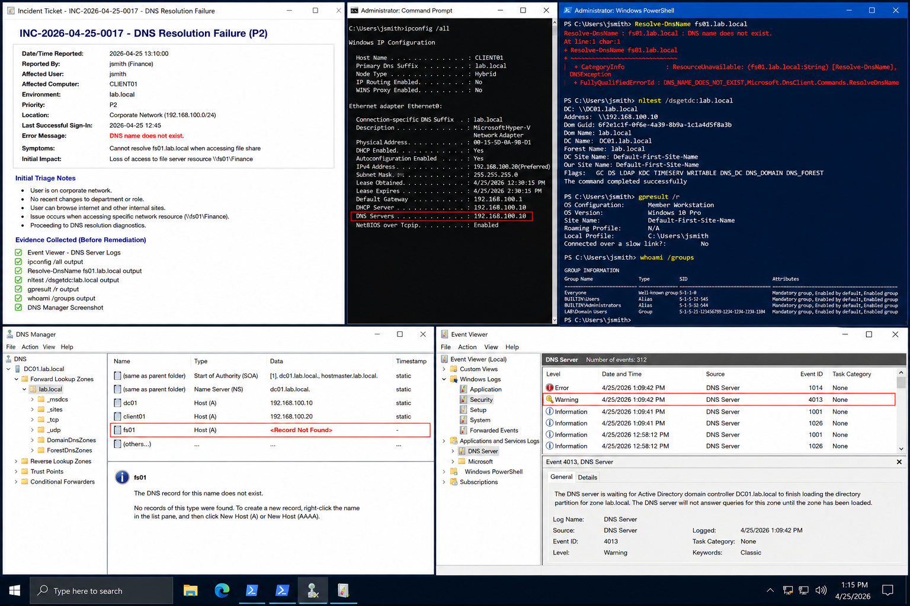

# Incident 04 DNS Resolution Failure - Issue Report

## Objective

---

This document records the initial issue report and triage process for a DNS resolution failure within the `lab.local` Windows Server 2022 environment.

The incident focuses on collecting initial evidence, validating the affected systems, and preparing the environment for structured diagnostics and remediation.

---

# Why It Matters

---

DNS failures can interrupt authentication, file access, application connectivity, and Group Policy processing across the environment.

Proper issue reporting helps:

- Preserve troubleshooting evidence
- Reduce repeated investigation steps
- Improve escalation quality
- Speed up root cause identification
- Support operational auditing

Accurate triage helps distinguish between:

- DNS failures
- Active Directory issues
- Group Policy problems
- Network connectivity failures
- File access problems

---

# Prerequisites

---

Before beginning triage, confirm:

- The issue can be reproduced safely
- Administrative tools are available
- The affected user or technician is reachable
- The incident ticket contains sufficient detail

Environment references:

| Component | Value |
|---|---|
| Domain | `lab.local` |
| DC01 | `192.168.100.10` |
| FS01 | `192.168.100.30` |
| CLIENT01 | `192.168.100.20` |

---

# GUI Procedure

---

1. Review the incident ticket and confirm:
   - Username
   - Computer name
   - Failure timestamp
   - Exact error message

2. Confirm the reported error:

```text
DNS name does not exist.
```

3. On `CLIENT01`, verify the user is connected to the corporate network.

4. Attempt to reproduce the issue using:

```powershell
Resolve-DnsName fs01.lab.local
```

5. Confirm whether the issue:
   - Affects multiple users
   - Occurs only on one workstation
   - Impacts additional network resources

6. On `DC01`, review:
   - DNS Manager
   - Event Viewer DNS logs
   - Client DNS configuration

7. Collect evidence before remediation begins.

---

# PowerShell Procedure

---

## Validate Network Configuration

```powershell
ipconfig /all
```

---

## Validate DNS Resolution

```powershell
Resolve-DnsName fs01.lab.local
```

---

## Validate Domain Controller Discovery

```powershell
nltest /dsgetdc:lab.local
```

---

## Review Applied Group Policies

```powershell
gpresult /r
```

---

## Validate User Group Membership

```powershell
whoami /groups
```

---

# Verification

---

The initial investigation should confirm:

- The issue is reproducible
- DNS resolution fails consistently
- Client DNS configuration is correct
- Domain communication remains operational
- Evidence collection is completed

Validation checklist:

| Validation Item | Expected Result |
|---|---|
| Network Connectivity | Successful |
| DNS Resolution | Failing as reported |
| Domain Controller Discovery | Successful |
| Client DNS Configuration | Correct |
| Evidence Collection | Completed |

---

# Common Issues And Fixes

---

| Issue | Cause | Resolution |
|---|---|---|
| DNS name does not exist | Missing DNS record | Create or correct A record |
| Incorrect DNS server | Client misconfiguration | Configure DNS to `192.168.100.10` |
| DNS resolution intermittent | Stale DNS cache | Flush client DNS cache |
| Domain lookup issue | DNS communication problem | Validate connectivity to `DC01` |

---

# Operational Quality Notes

---

This procedure is intended for the `lab.local` enterprise lab environment using Windows Server 2022 systems.

During incident triage:

- Record exact timestamps
- Preserve initial evidence
- Avoid immediate DNS changes
- Confirm the issue before remediation

Evidence should include:

- Event Viewer logs
- PowerShell output
- DNS Manager screenshots
- Group Policy results
- DNS resolution failures

Reference:

```text
../../ticketing-system/README.md
```

Do not close the incident until:

- Root cause is identified
- Standard-user validation succeeds
- Evidence is attached to the ticket
- Final remediation is verified

---

# Screenshot Capture

---

| Screenshot Requirement | Suggested Filename |
|---|---|
| Initial DNS failure investigation | `incident-04-dns-resolution-failure-issue-report-verification.png` |

---

## Screenshot Reference

---



