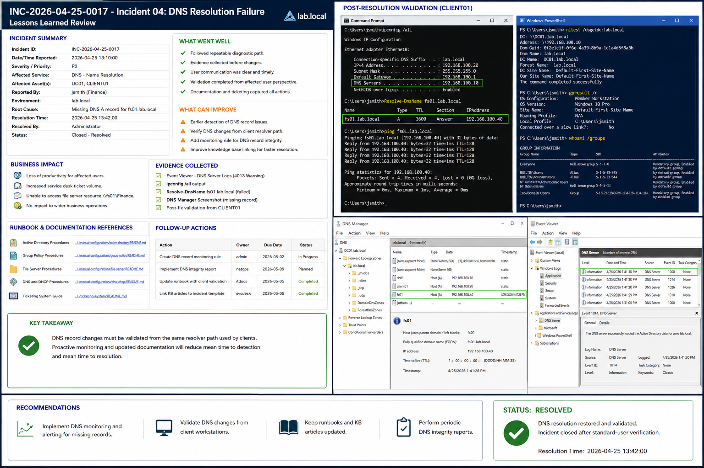

# Incident 04 DNS Resolution Failure - Lessons Learned

## Objective

---

This document records the operational lessons learned after resolving the DNS resolution failure within the `lab.local` Windows Server 2022 environment.

The purpose of this review is to improve future incident response efficiency, DNS validation processes, operational documentation, and monitoring practices.

---

# Why It Matters

---

A completed incident should improve operational processes and reduce the likelihood of recurrence.

Lessons learned reviews help:

- Improve troubleshooting consistency
- Reduce repeated DNS incidents
- Strengthen operational documentation
- Improve monitoring and detection
- Standardize remediation procedures

Operational maturity depends on documenting both successful actions and areas requiring improvement.

---

# Prerequisites

---

Before completing the lessons learned review, confirm:

- The incident is fully resolved
- Validation testing succeeded
- Evidence has been archived
- DNS resolution is operational
- Final remediation steps are documented

Environment references:

| Component | Value |
|---|---|
| Domain | `lab.local` |
| DC01 | `192.168.100.10` |
| FS01 | `192.168.100.30` |
| CLIENT01 | `192.168.100.20` |

---

# GUI Procedure

---

1. Review the completed incident ticket.

2. Confirm:
   - Root cause
   - DNS remediation steps
   - Validation results
   - Evidence collection

3. Verify screenshots and PowerShell transcripts are stored in the correct evidence location.

4. Review and update:
   - DNS operational documentation
   - Troubleshooting runbooks
   - Knowledge base articles

5. Confirm related documentation references are included:
   - Active Directory procedures
   - Group Policy procedures
   - File Server procedures
   - DNS and DHCP procedures

6. Create follow-up tasks for:
   - DNS monitoring improvements
   - Documentation updates
   - Validation workflow improvements
   - Knowledge base maintenance

7. Review the incident during the next operations meeting.

---

# PowerShell Procedure

---

## Validate DNS Resolution

```powershell
Resolve-DnsName fs01.lab.local
```

---

## Review DNS Client Configuration

```powershell
ipconfig /all
```

---

## Validate Domain Controller Discovery

```powershell
nltest /dsgetdc:lab.local
```

---

## Review Applied Group Policies

```powershell
gpresult /r
```

---

## Review DNS Server Events

```powershell
Get-EventLog -LogName DNS Server -Newest 20
```

---

# Verification

---

The lessons learned review should confirm:

- Root cause was identified correctly
- DNS remediation restored service
- Operational documentation was updated
- Follow-up actions were assigned
- Monitoring improvements were identified

Validation checklist:

| Validation Item | Expected Result |
|---|---|
| Incident Resolution | Completed |
| DNS Resolution | Successful |
| Documentation Update | Completed |
| Follow-Up Actions | Assigned |
| Standard User Validation | Successful |

---

# Common Issues And Fixes

---

| Issue | Cause | Resolution |
|---|---|---|
| Delayed DNS detection | Limited monitoring | Improve alerting and reporting |
| Inconsistent DNS validation | Server-only testing | Validate from client systems |
| Repeated DNS incidents | Missing documentation | Update runbooks and KB articles |
| Stale client resolution | Cached DNS entries | Flush DNS cache regularly |

---

# Operational Quality Notes

---

This procedure is intended for the `lab.local` Windows Server 2022 enterprise lab environment.

Operational best practices include:

- Recording evidence before remediation
- Testing DNS resolution from client systems
- Maintaining current operational documentation
- Using repeatable troubleshooting workflows
- Reviewing monitoring rules regularly

Reference the following operational documentation where applicable:

```text
../../manual-configurations/active-directory/README.md
../../manual-configurations/group-policy/README.md
../../manual-configurations/file-server/README.md
../../manual-configurations/dns-dhcp/README.md
../../ticketing-system/README.md
```

Capture evidence at the following stages:

| Stage | Example Evidence |
|---|---|
| Initial State | Failed DNS resolution |
| Configuration Change | DNS record creation |
| Final Verification | Successful client resolution |

Do not close the incident until:

- Standard-user validation succeeds
- Evidence is archived
- Documentation updates are completed
- Follow-up actions are assigned

---

# Screenshot Capture

---

| Screenshot Requirement | Suggested Filename |
|---|---|
| DNS lessons learned review and operational validation | `incident-04-dns-resolution-failure-lessons-learned-verification.png` |

---

## Screenshot Reference

---



