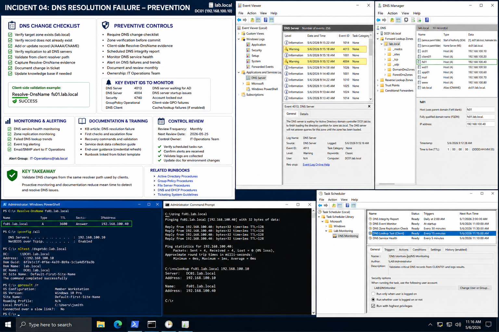

# Incident 04 DNS Resolution Failure - Prevention

## Objective

---

This document defines preventive controls and operational practices designed to reduce recurrence of DNS resolution failures within the `lab.local` Windows Server 2022 environment.

The prevention strategy focuses on:

- DNS validation procedures
- Monitoring and alerting
- Documentation improvement
- Operational auditing
- Change verification consistency

---

# Why It Matters

---

DNS failures can impact authentication, file access, application connectivity, and Group Policy processing across the enterprise environment.

Preventive controls help:

- Detect issues earlier
- Reduce operational downtime
- Improve troubleshooting efficiency
- Strengthen change management
- Improve DNS auditing visibility

Preventive measures are only effective when they are documented, monitored, reviewed, and operationally owned.

---

# Prerequisites

---

Before implementing preventive controls, confirm:

- DNS logging is enabled
- Monitoring systems are operational
- DNS Manager access is available
- Administrative ownership is assigned
- Documentation repositories are updated

Environment references:

| Component | Value |
|---|---|
| Domain | `lab.local` |
| DC01 | `192.168.100.10` |
| FS01 | `192.168.100.30` |
| CLIENT01 | `192.168.100.20` |

---

# GUI Procedure

---

1. Review DNS zone configuration on `DC01`.

2. Confirm DNS changes follow a documented approval process.

3. Verify DNS changes include:
   - Zone verification
   - Client-side resolution testing
   - Evidence collection

4. In Event Viewer, review monitoring coverage for:
   - DNS Server event `4013`
   - DNS Server event `4004`
   - Client DNS cache events
   - GroupPolicy operational events

5. Confirm scheduled monitoring tasks are operational.

6. Review DNS Manager for:
   - Stale records
   - Duplicate records
   - Missing A records
   - Replication status

7. Update operational documentation and knowledge base articles.

---

# PowerShell Procedure

---

## Validate DNS Resolution

```powershell
Resolve-DnsName fs01.lab.local
```

---

## Review DNS Client Configuration

```powershell
ipconfig /all
```

---

## Validate Domain Controller Discovery

```powershell
nltest /dsgetdc:lab.local
```

---

## Review DNS Server Events

```powershell
Get-EventLog -LogName "DNS Server" -Newest 20
```

---

## Review Applied Group Policies

```powershell
gpresult /r
```

---

# Verification

---

Preventive controls should confirm:

- DNS monitoring is operational
- DNS logging functions correctly
- Client-side validation succeeds
- Documentation is updated
- Review ownership is assigned

Validation checklist:

| Validation Item | Expected Result |
|---|---|
| DNS Monitoring | Operational |
| Event Logging | Enabled |
| Client DNS Validation | Successful |
| Documentation Updates | Completed |
| Preventive Review Schedule | Assigned |

---

# Common Issues And Fixes

---

| Issue | Cause | Resolution |
|---|---|---|
| Missing DNS records | Incomplete DNS changes | Require validation checklist |
| Delayed DNS detection | No monitoring | Implement DNS alerting |
| Stale client resolution | Cached DNS entries | Flush DNS cache |
| Incorrect DNS verification | Server-only testing | Validate from client systems |

---

# Operational Quality Notes

---

This procedure is intended for the `lab.local` Windows Server 2022 enterprise lab environment.

Operational best practices include:

- Validating DNS changes from client systems
- Recording evidence before remediation
- Maintaining updated runbooks
- Reviewing monitoring regularly
- Using repeatable DNS troubleshooting workflows

Recommended monitoring includes:

| Monitoring Area | Recommended Event |
|---|---|
| DNS Server Health | DNS Server `4013` |
| DNS Startup Issues | DNS Server `4004` |
| Account Lockouts | Security `4740` |
| Group Policy Failures | GroupPolicy Operational Log |

Reference documentation:

```text
../../manual-configurations/active-directory/README.md
../../manual-configurations/group-policy/README.md
../../manual-configurations/file-server/README.md
../../manual-configurations/dns-dhcp/README.md
../../ticketing-system/README.md
```

Review preventive controls monthly to confirm:

- Scripts still execute successfully
- Logs are retained properly
- Alerts reach the correct operational team
- Documentation reflects the current environment

Do not rely on undocumented scripts or unverified monitoring rules in production environments.

---

# Screenshot Capture

---

| Screenshot Requirement | Suggested Filename |
|---|---|
| DNS preventive controls and monitoring validation | `incident-04-dns-resolution-failure-prevention-verification.png` |

---

## Screenshot Reference

---



