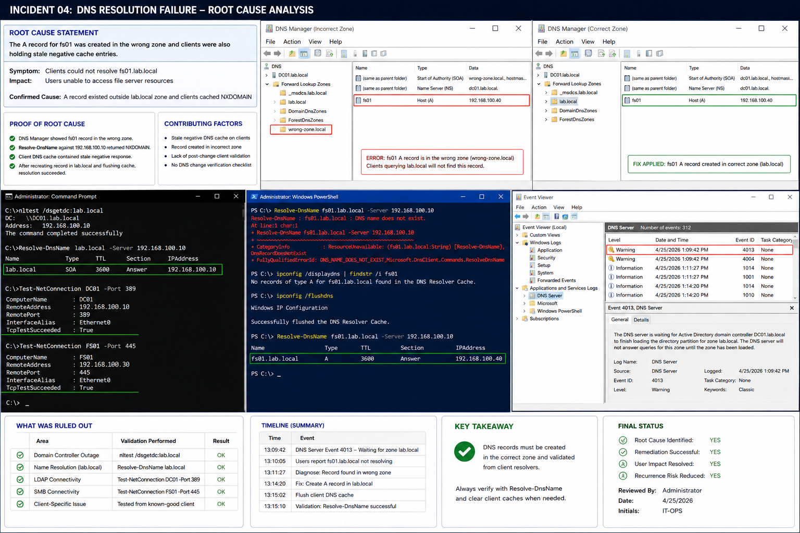

# Incident 04 DNS Resolution Failure - Root Cause

## Objective

---

This document records the confirmed root cause analysis for the DNS resolution failure within the `lab.local` Windows Server 2022 environment.

The purpose of this review is to identify the exact DNS failure condition, document supporting evidence, and separate the confirmed root cause from contributing environmental conditions.

---

# Why It Matters

---

Root cause analysis prevents recurring DNS incidents by identifying the actual configuration failure instead of only correcting the visible symptom.

A complete root cause review helps:

- Improve troubleshooting accuracy
- Reduce repeated DNS incidents
- Strengthen operational documentation
- Improve DNS validation workflows
- Support audit and compliance requirements

The incident is not considered resolved until the technical team can explain:

- Why the issue occurred
- Why it affected the specific systems
- Why it appeared at that time

---

# Prerequisites

---

Before completing root cause analysis, confirm:

- Diagnostic evidence has been collected
- Validation testing is complete
- DNS logs are available
- Client-side reproduction succeeded
- Remediation actions are documented

Environment references:

| Component | Value |
|---|---|
| Domain | `lab.local` |
| DC01 | `192.168.100.10` |
| FS01 | `192.168.100.30` |
| CLIENT01 | `192.168.100.20` |

---

# GUI Procedure

---

1. Review the incident ticket and collected evidence.

2. Confirm the affected systems:
   - Could not resolve `fs01.lab.local`
   - Returned DNS lookup failures

3. On `DC01`, review:
   - DNS Manager
   - DNS zone structure
   - Event Viewer DNS logs

4. Confirm the `fs01` A record:
   - Existed outside the correct `lab.local` zone
   - Was unavailable to clients using standard resolution paths

5. Validate client-side failures using:
   - `Resolve-DnsName`
   - Client DNS cache review
   - DNS Manager verification

6. Confirm stale negative DNS cache entries existed on affected clients.

7. Validate the issue no longer reproduces after:
   - Correct DNS record creation
   - Client DNS cache flush
   - DNS replication completion

---

# PowerShell Procedure

---

## Validate DNS Resolution

```powershell
Resolve-DnsName fs01.lab.local -Server 192.168.100.10
```

---

## Validate Domain Controller Discovery

```powershell
nltest /dsgetdc:lab.local
```

---

## Validate LDAP Connectivity

```powershell
Test-NetConnection DC01 -Port 389
```

---

## Validate SMB Connectivity

```powershell
Test-NetConnection FS01 -Port 445
```

---

## Review DNS Client Configuration

```powershell
ipconfig /all
```

---

## Review Applied Group Policies

```powershell
gpresult /r
```

---

# Verification

---

The confirmed root cause should validate the following findings:

| Validation Item | Result |
|---|---|
| DNS Record Placement | Incorrect zone |
| Client DNS Resolution | Failed |
| DNS Server Response | NXDOMAIN |
| Domain Controller Discovery | Successful |
| LDAP Connectivity | Successful |
| SMB Connectivity | Successful |

The issue is considered resolved only after:

- DNS records are recreated correctly
- Client DNS caches are flushed
- Name resolution succeeds consistently
- DNS failure events stop recurring

---

# Common Issues And Fixes

---

| Issue | Cause | Resolution |
|---|---|---|
| NXDOMAIN response | Missing or misplaced DNS record | Recreate record in correct zone |
| DNS issue persists after fix | Cached negative response | Flush client DNS cache |
| DNS resolution inconsistent | Replication delay | Wait for DNS replication |
| Client resolution failure | Incorrect DNS server | Configure client DNS correctly |

---

# Operational Quality Notes

---

This procedure is intended for the `lab.local` Windows Server 2022 enterprise lab environment.

Operational best practices include:

- Capturing evidence before remediation
- Verifying DNS records carefully
- Testing from client systems
- Separating contributing factors from root cause
- Recording timestamps and exact commands

The following conditions were ruled out during investigation:

| Validation Area | Verification Method |
|---|---|
| Domain Controller Availability | `nltest /dsgetdc:lab.local` |
| DNS Server Connectivity | `Resolve-DnsName lab.local` |
| LDAP Connectivity | `Test-NetConnection DC01 -Port 389` |
| SMB Connectivity | `Test-NetConnection FS01 -Port 445` |
| Client Workstation Failure | Known-good client validation |

Reference documentation:

```text
../../ticketing-system/README.md
```

Do not close the incident until:

- Root cause is fully documented
- Evidence is archived
- Standard-user validation succeeds
- Recurrence testing is complete

---

# Screenshot Capture

---

| Screenshot Requirement | Suggested Filename |
|---|---|
| DNS root cause investigation and validation | `incident-04-dns-resolution-failure-root-cause-verification.png` |

---

## Screenshot Reference

---



