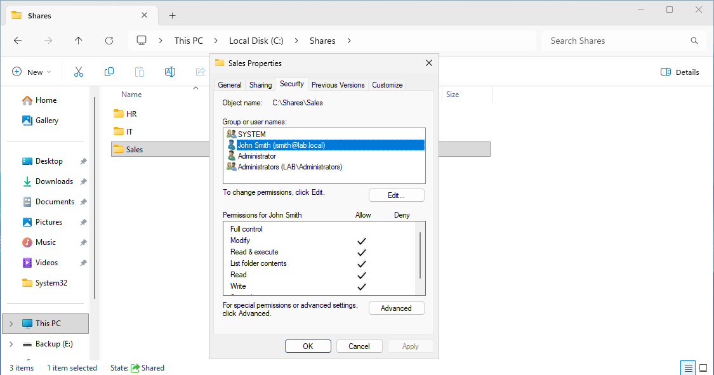

# Create Shared Folder

## Objective

Create a shared folder for department file storage in the `lab.local` environment.

---

# Why It Matters

Shared folders provide centralized file storage, controlled access, and simplified management for users and departments.

This lab environment uses:

| System | Role | IP Address |
|---|---|---|
| DC01 | Domain Controller | 192.168.100.10 |
| FS01 | File Server | 192.168.100.40 |
| CLIENT01 | Windows Client | 192.168.100.20 |

Network:

```text
192.168.100.0/24
```

Domain:

```text
lab.local
```

The shared folder created in this guide:

```text
D:\Shares\Sales
```

SMB Share Name:

```text
Sales
```

---

# Prerequisites

Before starting:

- File Server role available
- DNS functioning correctly
- PowerShell running as Administrator
- `FS01` reachable from `CLIENT01`

Verify SMB service:

```powershell
Get-Service LanmanServer
```

Verify network connectivity:

```powershell
Test-NetConnection FS01 -Port 445
```

---

# GUI Procedure

1. On `FS01`, create the folder:

```text
D:\Shares\Sales
```

2. Right-click the folder:

```text
Properties
→ Sharing
→ Advanced Sharing
```

3. Enable:

```text
Share this folder
```

4. Configure:

| Setting | Value |
|---|---|
| Share Name | Sales |
| Share Permission | Authenticated Users - Change |

5. Configure NTFS permissions:

```text
Properties
→ Security
```

6. Add:

```text
GG_Sales_Users
```

7. Assign:

```text
Modify
```

---

# PowerShell Procedure

Start logging:

```powershell
Start-Transcript -Path C:\Logs\create-shared-folder.txt -Append
```

Create the folder:

```powershell
New-Item -Path "D:\Shares\Sales" -ItemType Directory -Force
```

Create SMB share:

```powershell
New-SmbShare -Name "Sales" -Path "D:\Shares\Sales" -ChangeAccess "Authenticated Users"
```

Configure NTFS permissions:

```powershell
icacls "D:\Shares\Sales" /grant "lab\GG_Sales_Users:(M)"
```

Stop logging:

```powershell
Stop-Transcript
```

---

# Verification

## Verify SMB Share

Run:

```powershell
Get-SmbShare -Name Sales
```

Expected result:

```text
Sales
D:\Shares\Sales
```

---

## Verify Share Permissions

Run:

```powershell
Get-SmbShareAccess -Name Sales
```

Expected result:

```text
Authenticated Users    Change
```

---

## Verify NTFS Permissions

Run:

```powershell
Get-Acl "D:\Shares\Sales"
```

Confirm:
- `GG_Sales_Users`
- Modify permissions assigned

---

## Verify Client Access

On `CLIENT01`, open:

```text
\\FS01\Sales
```

Or run:

```powershell
Test-Path "\\FS01\Sales"
```

Create a test file inside the share to confirm write access.

---

# Common Issues And Fixes

## Share Not Reachable

Verify SMB connectivity:

```powershell
Test-NetConnection FS01 -Port 445
```

Verify File and Printer Sharing is enabled.

---

## Access Denied

Verify:
- Share permissions
- NTFS permissions
- Group membership

Refresh user logon session if permissions were recently changed.

---

## SMB Share Missing

List shares:

```powershell
Get-SmbShare
```

Recreate the share if necessary.

---

## Name Resolution Failure

Verify DNS resolution:

```powershell
Resolve-DnsName FS01
```

Confirm client DNS server:

```text
192.168.100.10
```

---

# Screenshot Capture


