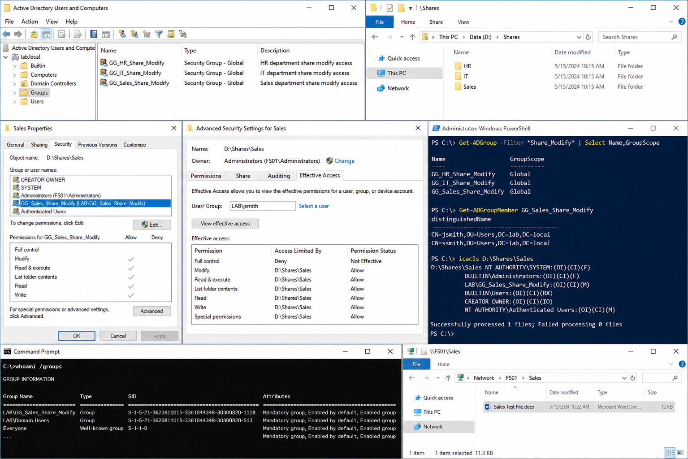

# Department Share Model

## Objective

Create a department-based file share structure using Active Directory security groups and NTFS permissions.

---

# Why It Matters

Department-based access control improves:
- permission management
- access auditing
- onboarding and offboarding
- security administration

This lab environment uses:

| System | Role | IP Address |
|---|---|---|
| DC01 | Domain Controller | 192.168.100.10 |
| FS01 | File Server | 192.168.100.40 |
| CLIENT01 | Windows Client | 192.168.100.20 |

Domain:

```text
lab.local
```

Department shares:

```text
D:\Shares\Sales
D:\Shares\HR
D:\Shares\IT
```

Department security groups:

```text
GG_Sales_Share_Modify
GG_HR_Share_Modify
GG_IT_Share_Modify
```

---

# Prerequisites

Before starting:

- Active Directory operational
- File shares created
- DNS functioning correctly
- PowerShell running as Administrator

Verify Active Directory access:

```powershell
Get-ADDomain
```

Verify existing shares:

```powershell
Get-SmbShare
```

---

# GUI Procedure

## Create Department Folders

Create:

```text
D:\Shares\Sales
D:\Shares\HR
D:\Shares\IT
```

---

## Create Security Groups

Open:

```text
Active Directory Users and Computers
```

Navigate to:

```text
OU=Groups
```

Create:
- GG_Sales_Share_Modify
- GG_HR_Share_Modify
- GG_IT_Share_Modify

Group type:

```text
Security
```

Group scope:

```text
Global
```

---

## Configure NTFS Permissions

For each department folder:

```text
Properties
→ Security
→ Edit
```

Grant:
- department group
- Modify permission

Example:

```text
GG_Sales_Share_Modify → Modify
```

Avoid assigning permissions directly to users.

---

# PowerShell Procedure

Start logging:

```powershell
Start-Transcript -Path C:\Logs\department-share-model.txt -Append
```

Create AD groups:

```powershell
New-ADGroup -Name "GG_Sales_Share_Modify" -GroupScope Global -GroupCategory Security -Path "OU=Groups,DC=lab,DC=local"
```

```powershell
New-ADGroup -Name "GG_HR_Share_Modify" -GroupScope Global -GroupCategory Security -Path "OU=Groups,DC=lab,DC=local"
```

```powershell
New-ADGroup -Name "GG_IT_Share_Modify" -GroupScope Global -GroupCategory Security -Path "OU=Groups,DC=lab,DC=local"
```

Assign NTFS permissions:

```powershell
icacls "D:\Shares\Sales" /grant "LAB\GG_Sales_Share_Modify:(OI)(CI)M"
```

```powershell
icacls "D:\Shares\HR" /grant "LAB\GG_HR_Share_Modify:(OI)(CI)M"
```

```powershell
icacls "D:\Shares\IT" /grant "LAB\GG_IT_Share_Modify:(OI)(CI)M"
```

Stop logging:

```powershell
Stop-Transcript
```

---

# Verification

## Verify AD Groups

Run:

```powershell
Get-ADGroup GG_Sales_Share_Modify
```

```powershell
Get-ADGroup GG_HR_Share_Modify
```

```powershell
Get-ADGroup GG_IT_Share_Modify
```

---

## Verify Group Membership

Run:

```powershell
Get-ADGroupMember GG_Sales_Share_Modify
```

---

## Verify NTFS Permissions

Run:

```powershell
icacls "D:\Shares\Sales"
```

Confirm:
- correct department group exists
- Modify permission assigned

---

## Verify Client Access

On `CLIENT01`, open:

```text
\\FS01\Sales
```

Create a test file to confirm write access.

---

# Common Issues And Fixes

## Access Denied

Verify:
- NTFS permissions
- share permissions
- group membership

Refresh user logon session after group changes.

---

## Group Membership Not Updating

Sign out and sign back in.

Verify membership:

```powershell
whoami /groups
```

---

## Folder Permissions Incorrect

Reset inheritance if required:

```powershell
icacls "D:\Shares\Sales" /inheritance:e
```

---

## SMB Share Unreachable

Verify connectivity:

```powershell
Test-NetConnection FS01 -Port 445
```

Verify DNS:

```powershell
Resolve-DnsName FS01
```

---

# Screenshot Capture


